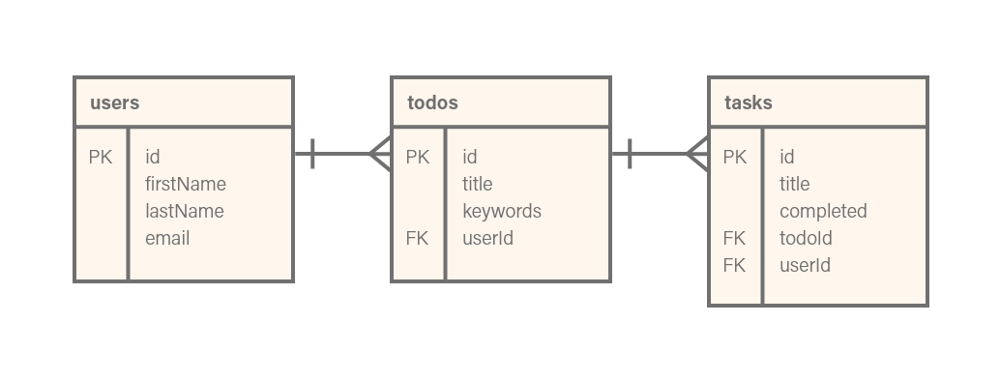
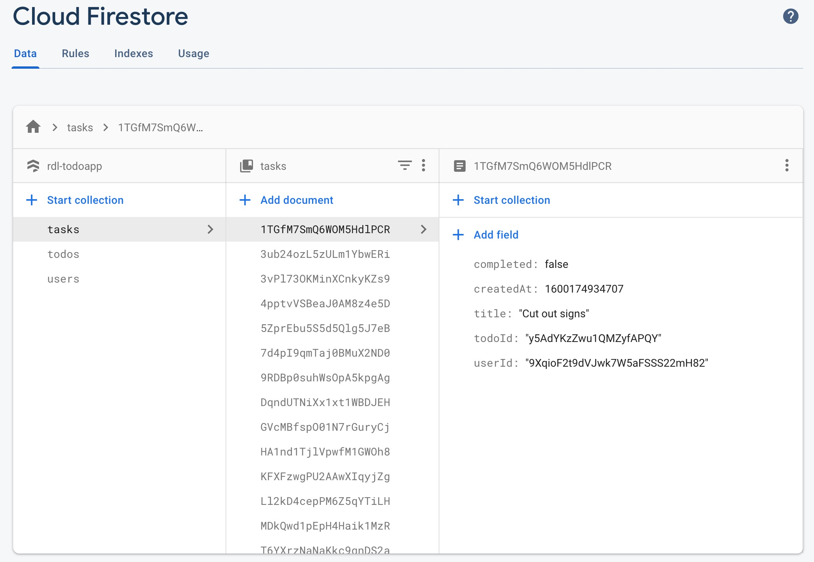

## Information Architecture

The app includes only a handful of top-level pages, including a home page, an about page, and sign-up/login pages. For an authenticated user additional pages include a profile page, a To Do Lists page, and a keyword page.

The most complex structure of the site is the To Do lists, which includes a `/lists` page that displays all of the users' lists. Each list card has an button to edit the list. When clicked the user will be directed to a `/lists/:id` page that displays information for the list matching the id value.

{:class="project-detail-image--full"}
{:class="project-detail-container"}

Entity Relationship Diagram
{:class="project-detail-caption"}

#### Database Design

The app makes use of Firebase for it's database. Specifically, the site's data is contained in a NoSQL Cloud Firestore database that includes three collections for users, tasks, and todos.

{:class="project-detail-image--full"}
{:class="project-detail-container"}

Firebase - Cloud Firestore
{:class="project-detail-caption"}

The decision to include keywords as an array list within the todos collection was based on simplifying the queries to Firestore by finding keyword matches against a list of keywords in a user's todos held in state.
