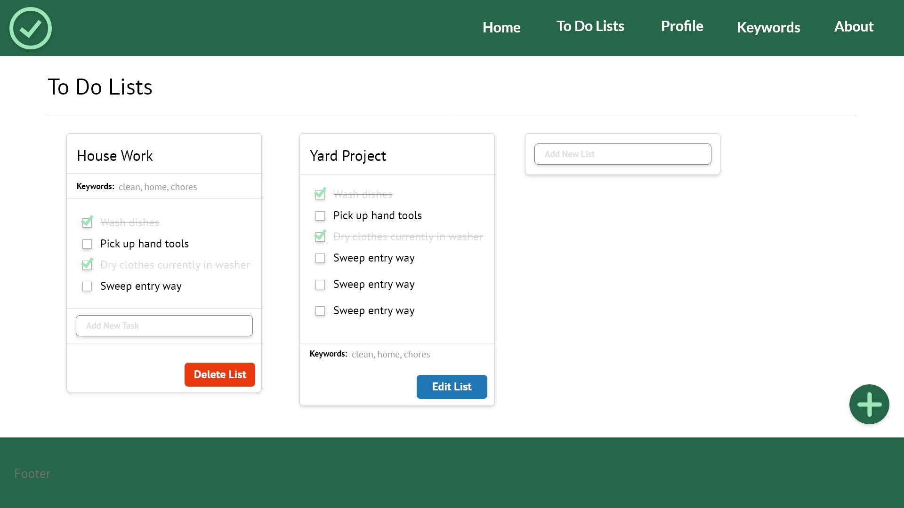
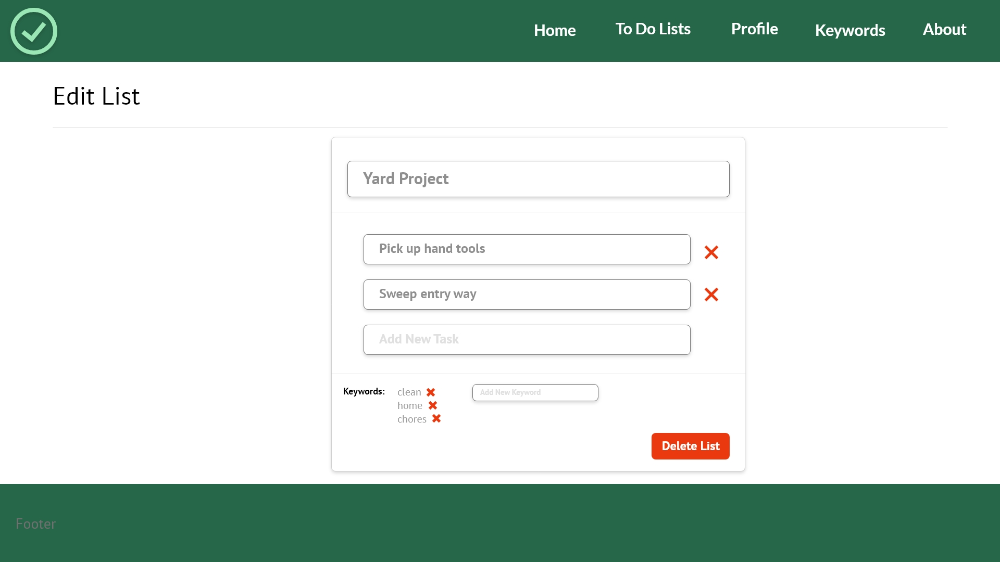

## UX Design

Since this app was simple in scope and a common type of app for developers to practice their skills, much of the UX design was uncomplicated. Things like the header, navigation, and footer were all fairly typical - left aligned logo and right aligned navigation options. The footer was also a fairly typical design, which included three center-aligned columns of navigational links, although not yet added into my wireframes.

#### To Do Detail Page

The major area for UX design was the detail and edit pages for a To Do item. Following a somewhat typical design for to-do lists, the chosen design included a card layout with a heading text for the list title, a list of to-do items that included a checkbox for each. When a checkbox was checked, the list item would show a strike through text and a lighter color. The card also included buttons for editing and deleting. An element not always included in to-do lists is an additional row of keywords for each list. This was added in a separate section of the card.

{:class="project-detail-image--full"}
{:class="project-detail-container"}

Wireframe - Checkmark List App - To Do List Detail Page
{:class="project-detail-caption"}

#### To Do Edit Page

On the page to edit a To Do list, the wireframe included a pre-populated input field that gives the ability to edit either the list title or any of the to do task items. There is also the ability to delete a to do item and/or keywords. Finally, there are blank inputs to add a new to do task item or keyword. Finally, there's a delete button that will delete the entire list including list tasks and the list itself.

{:class="project-detail-image--full"}
{:class="project-detail-container"}

Wireframe - Checkmark List App - Edit To Do Page
{:class="project-detail-caption"}

#### Component-Based Visual Design

The visual design of the app makes use of Tailwind CSS version 1.8.5. Employing this CSS framework with React enabled straight forward component design. Several different components were created using this approach, including:

- Page headings
- General use headings
- Inputs
- Buttons

These components were then combined to make more complex components, including:

- To Do Card
- Task List
- Keyword List

Although the scale of this particular application is small, employing a component-based design system can add efficiency to a larger application since the design of the individual components allows for consistency in the user experience.
