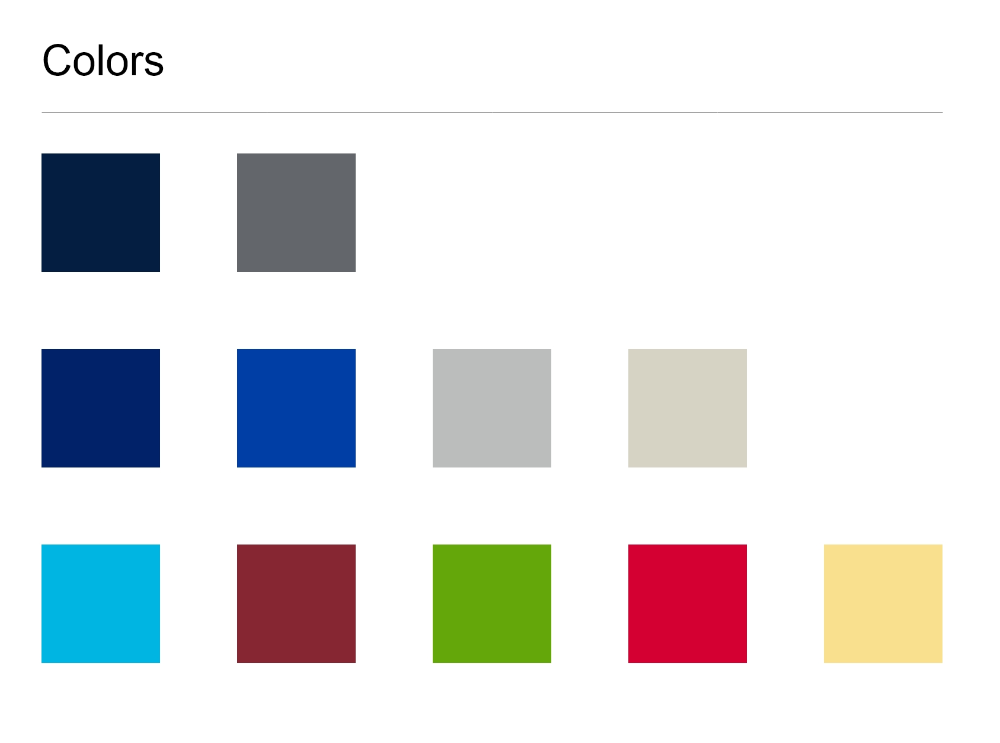
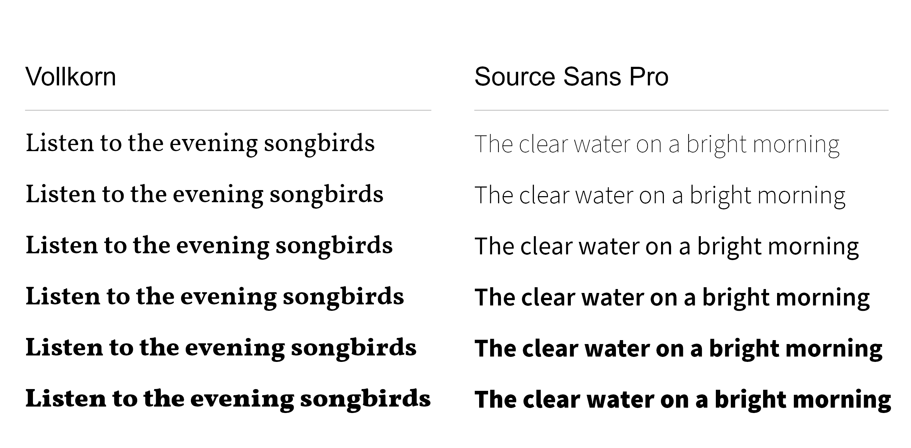
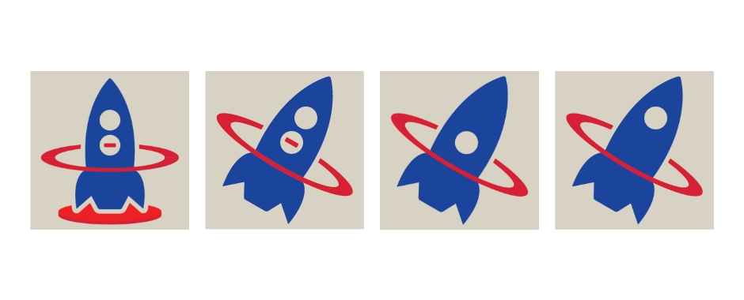
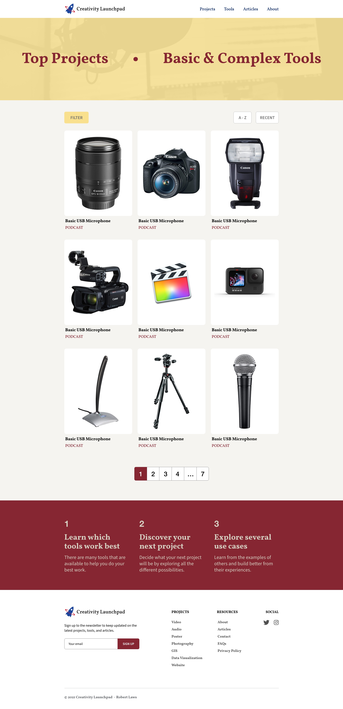
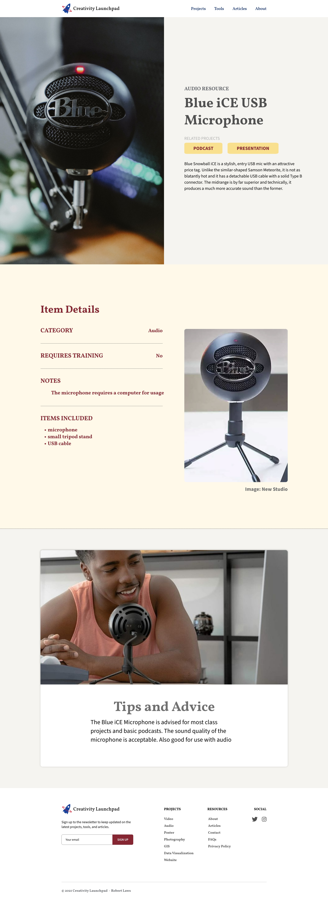

## UX Design

The UX design phase built upon previous phases - incorporating the more clearly defined information architecture structure into the design at this point. The design also builds up the UX exploration phase introducing well-defined assets that include a foundational color scheme, typography, and website icons. Whereas each includes elements of experimentation, they are also chosen with the intent to be used the actual assets that will be used in the website.

{:class="project-detail-image--full"}
{:class="project-detail-container"}

Color Palette
{:class="project-detail-caption"}

{:class="project-detail-image--full"}
{:class="project-detail-container"}

Typography
{:class="project-detail-caption"}

The logo design reflects an evolution in the design and a link to the spirit behind the website. The idea of a Creativity Launchpad is meant to evoke a starting point on a journey of creativity. The website's goal is to help "launch" students on their creative journey and provide a starting point for the steps they will take to choose what type of creative project they want to do and what tools they will use.

The logo design shows an evolution in the idea behind these themes. Starting from a design that has a rocket sitting vertically on a launchpad, the design moved into a more active version of a rocket in motion. The rocket passes through a ring to suggest motion and progress. The colors for the logo are based on prominent colors from the chosen color palette.

{:class="project-detail-image--full"}
{:class="project-detail-container"}

Logo Design
{:class="project-detail-caption"}

Making further use of the website assets, the full prototypes of the website design were able to take shape. The result was a design that makes use of the colors, typography, logos, and sample content that reflected the website that would be built.

{:class="project-detail-image--full"}
{:class="project-detail-container"}

Prototype - Home Page
{:class="project-detail-caption"}

The design more clearly shows the bold approach to the resource page, which would inspiration for the design of other pages on the website.

{:class="project-detail-image--full"}
{:class="project-detail-container"}

Prototype - Resource Page
{:class="project-detail-caption"}
