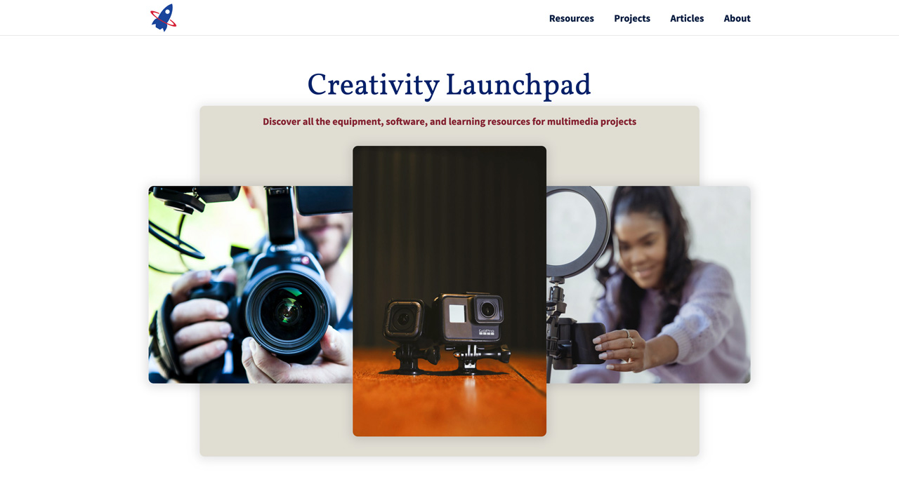

## Introduction

Students at my organization occasionally have assignments or projects that require working with media production tools and software. To work on these types of assignments, students come to the library to make use of the different hardware, software, and learning resources available to them. The process of discovering and choosing from the many resources available can be overwhelming at first. This is where the library can jump in and provide a tool that will help students discover recommended resources based on their specific project requirements. The library can also help them explore the full range of resources available to them and learn about different types of media, creation workflows, and where to look to learn more about media production processes.

#### The Challenge

Students have a long list of tools, software, and learning resources available to choose from when working on their assignments. Simply providing a long list to scroll through is not good enough. The challenge of this project is to build a website that presents the full range of data available in a way that is intuitive to explore and digest. Students may also have different preferences for exploring the data. For example some students may prefer using filtering utilities to explore lists of resources and other students may prefer reading detailed information on a particularly resource or topic. An additional challenge is finding ways to satisfy the different preferences and maximizing the usability of the website. Finally, there is a challenge of making the website as accessible as possible for all users, which means that the website must be compliant with WCAG accessibility standards, the website must offer low-bandwidth users an optimized experience, and the website must provide a high-quality user experience on all devices.

#### The Solution

To meet the challenges of the website, particular attention must be given to content development. For the website to be successful, the content must be rich - to provide the most useful information to students, but it must also include good data design to include enough descriptive richness and connections between related data to allow for enhanced filtering and sorting. The solution also involves combining data in interesting ways to make it more compelling. For example, there are many different resources for filming videos such as video camera hardware, video editing software, and e-books on how to edit video content. These resources can be combined together with an article that introduces students to the overall process of video creation and editing. The same data can be combined as a list of necessary resources and steps on how to find each in the library.

{:class="project-detail-image--full"}
{:class="project-detail-container"}

Creativity Launchpad - Project Website Homepage
{:class="project-detail-caption"}

#### Technologies Used

The project requires a wide range of technologies to create the website. First, the website data is stored in the JSON file format and loaded dynamically using asynchronous requests. Once loaded, the data will be displayed on the website and make use of modern layout techniques such as CSS Grid and Flexbox. A rich range of semantic HTML will be used in conjunction with WAI-ARIA roles and properties to enhance website accessibility. The website will also make use of ES6 JavaScript features, particularly array methods, to allow users to filter and re-organize website data. Finally, the stock photos used in the website are from the free stock photo websites: [Unsplash](https://unsplash.com/), [Pixabay](https://pixabay.com/) and [Pexels](https://pexels.com/).
