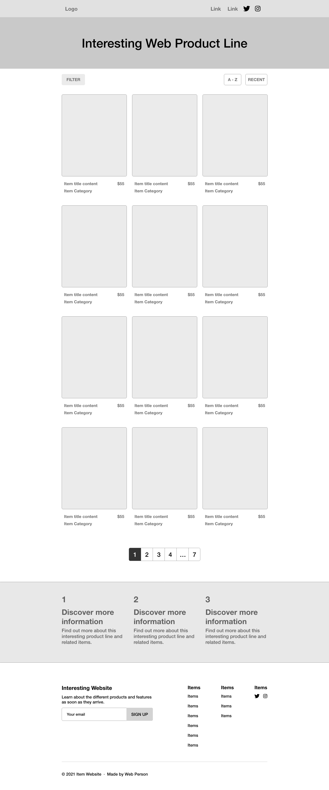
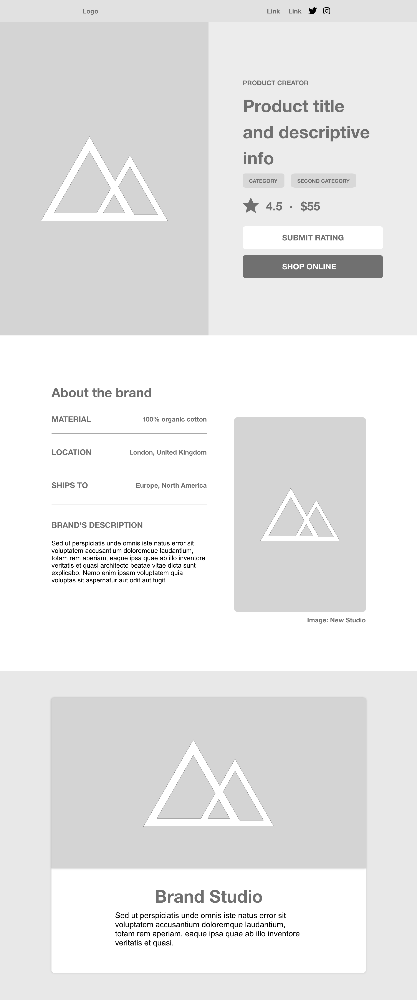

## UX Exploration

Building on the UX research phase, the UX exploration phase was able to construct several low-fidelity wireframes to begin experimenting with designs that could meet the needs of the user. The home page wireframe places focus on the resources a user may want to explore. At this point of the design, the focus is on getting the information to the user immediately - as reflected in the grid of resources that take up the majority of the page. The idea is that users can view and select a resource to learn more about as soon as they load the website.

{:class="project-detail-image--full"}
{:class="project-detail-container"}

Wireframe - Home Page
{:class="project-detail-caption"}

Once a user selects a resource they want to know more about, the user is brought to the resource page. The resource page exploration focuses on combining information with visual examples of the resource in use. The idea is to provide information, but also create some visual appeal that could reflect the younger target audience appreciation of a bold visual design.

{:class="project-detail-image--full"}
{:class="project-detail-container"}

Wireframe - Resource Page
{:class="project-detail-caption"}
