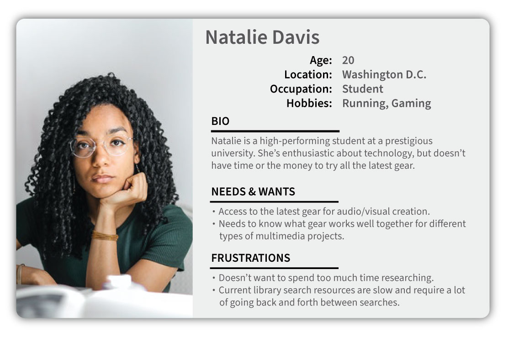

## UX Research

The UX research phase of the project focused primarily on speaking with potential students of the website. In this case, the target audience will be university students who have assignments that require use and creation of multimedia tools. A student may be assigned or voluntarily choose to use multimedia to fulfill their assignment requirements, but may not necessarily know how to start, what tools are available, and what workflows make the most sense for their project. A student with these needs and desires is the precise target audience for the website.

After speaking with students who can fit into this category of potential audience for the website, it's possible to build a typical persona representing the target audience. The research from building personas shows that the most likely user of the website wants something that provides essential information about what resources are available, what their capabilities and features are, and how best to use them, especially for complex projects.

{:class="project-detail-image--full"}
{:class="project-detail-container"}

Persona - College Student
{:class="project-detail-caption"}

Doing UX research, even on this most basic level, provides invaluable information about how the website can be designed to meet the needs of the target audience. This addresses the central reason for doing UX research, because it can provide insights from real users that is more helpful than a designer assuming he or she knows what the user wants.
