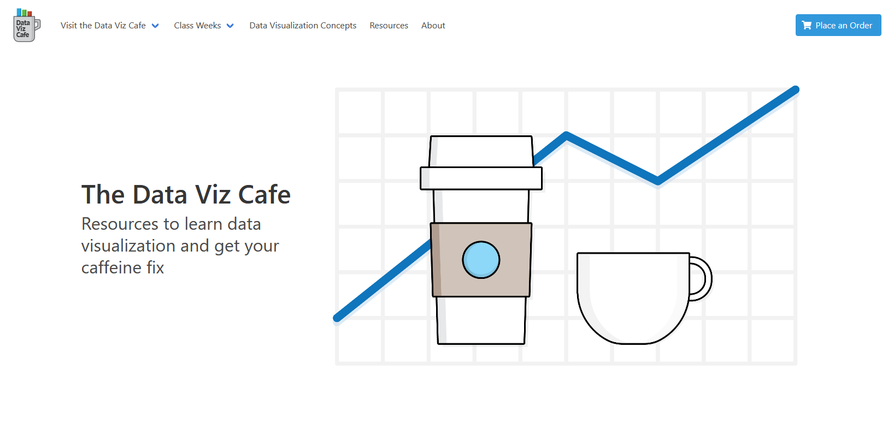

## Introduction

In preparation for teaching a course on data visualization, the idea of making a companion website came into my head. The course focuses on learning core concepts of data visualization, including design, data handling, and analysis. These concepts seem straight-forward at first glance - like putting together a quick bar or pie chart - but there's actually a large amount of complexity involved, especially to make effective data visualizations. Students will need to understand how data is created, stored, accessed, and finally manipulated to build a range of visualizations that can form part of an analysis.

#### The Challenge

The challenge of the project is to design and develop a website that can demonstrate the idea of how data is created, stored, and accessed, while also serving the purpose of educating students about key data visualization concepts and providing resources that they can use in their study of the topic. Combining all of these various purposes for the website and making them all interconnected and interesting makes the project challenging.

#### The Solution

The solution is to design a website that replicates a real-world scenario of data collecting, storing, and accessing. In this case, an online store to place orders for cafe products. The data that is collected (and mocked-up) for the imaginary online cafe can then be used to demonstrate and teach core concepts of data visualization and analysis. The website would also double as a learning portal for course materials and content, dividing up topical areas of the course with examples using the online cafe theme and models. The resultant website will help students understand the process of creating data and analyzing it through data visualization.

---

{:class="project-detail-image--full"}
{:class="project-detail-container"}

Library Website - Project Website
{:class="project-detail-caption"}

#### Requirements

The following requirements make up different aspects of the goals of the website

##### Home Page

- Must have a 'real-world', marketing-focused look and feel
- Must execute a visual theme that combines an online cafe with data visualization motifs
- Must include call to actions to place an order

##### Navigation

- Must have links to the online store and data collection components of the website
- Must have links to the data visualization learning sections of the website

##### Online Order

- Must allow a user to select a location to place/pickup an order
- Must allow a user to browser and select products, place products into a cart, and submit orders
- Must have a visual component to show a user their order - ex. graphics of products purchased

##### Data Collection

- Must save user orders based on an "order" or "transaction" data model
- Must show users a listing (ex. in a data table) of transactions
- Must link back to a downloadable or connectable data source (ex. Google Sheets)

##### Learning Sections

- Must include a resources section that includes useful links, video (embedded or links), and presentational content
- Must include examples of data visualizations drawing from the website theme of an online cafe
- Must divide up content based on schedule of introducing the course content
