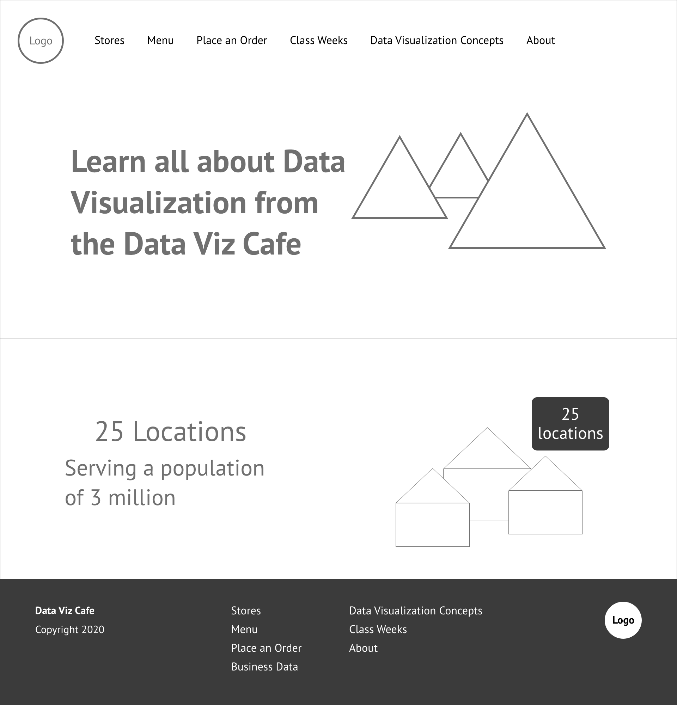
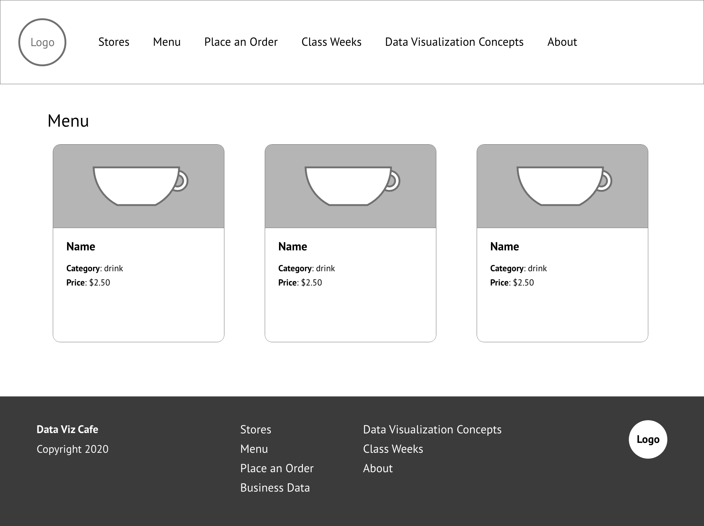

## UX Design

The design of the Data Viz Cafe website is meant to resemble a real online coffee shop, even though the coffee shop is fictitious. The concept for the home page is focused on marketing the fictitious coffee shop with a hero image at the top of the page and a mix of descriptive information about the website concept and call-outs highlighting top features of the website.

The wireframes for the design reflect the marketing focus. The home page wireframe includes the concept for the hero section and a secondary section with call out text and another image.

{:class="project-detail-image--full"}
{:class="project-detail-container"}

Wireframe - Data Viz Cafe Home Page
{:class="project-detail-caption"}

The navigation for the site went through an evolutionary process. The first version positioned the site logo in the center of the header with the navigation split to the left and right. This made sense at first because the content of the site is thematically divided between course support content and the pages that formed the store front including descriptive information for the coffee shop locations, menu choices, and order form.

The subpages for the store front part of the website is consistent with the home page focus on marketing. For example, the menu listing page makes heavy use of imagery in a grid layout, each menu item laid out in a card component containing an image and descriptive information.

{:class="project-detail-image--full"}
{:class="project-detail-container"}

Wireframe - Data Viz Cafe Menu Listings
{:class="project-detail-caption"}

The course content pages place much more focus on textual content, including lists of resources, outlines of topics covered in each class week, and course topic definitions.

The design of the site is made using the [Bulma CSS Framework](https://bulma.io/). The main attraction of using Bulma is the component and element features, especially the modal, that sped up the design process. There did some to be a lack of a full set of responsive design features, but this isn't a major problem since the site isn't implementing an overly complex design.
