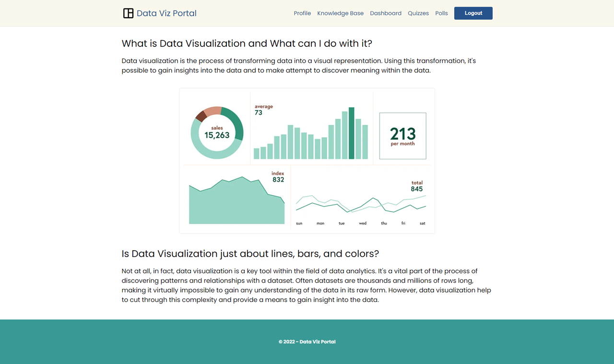

## Introduction

In the Spring of 2022, I am teaching students about data visualization. In an effort to help students with the learning process, I came up with the concept of a website that would provide opportunities to learn and test their knowledge about data visualization. The result of this work was the Data Viz Portal. This website has the goal of helping students discover and learn about data visualization on an attractive and interactive space.

#### The Challenge

Students enrolled in the class called Introduction to Data Visualization can find it difficult to wade through all the information that is available to them about understanding and building data visualizations. They can feel overwhelmed if there's either too much information or it's not organized in a way that is easy to understand. Students also need to test their learning, which is an important part of the learning process.

#### The Solution

The solution to this challenge is a website that combines resources with a place for students to take quizzes to test their knowledge. The resulting website would be a single location to address multiple student needs. Students can visit the website to access links to useful resources, view videos about Data Visualization, see examples of data visualizations, and take quizzes to test their knowledge. The website is also fully responsive, allowing students to view the website on a mobile device and access information from their preferred study space or when they are on the go. The website also provides students with a user account so they can track their progress taking the quizzes.

{:class="project-detail-image--full"}
{:class="project-detail-container"}

Data Viz Portal - Project Website Homepage
{:class="project-detail-caption"}

#### Technologies Used

The project made use of React for development of the user interface and incorporated supporting technologies such as React Router and React Google Charts. Data was stored in a Firestore database, which makes use of the Firebase service and SDK. The website also takes advantage of the Firebase authentication and hosting services. The development of the project website made use of Sass to organize and automate the styling for the website.
