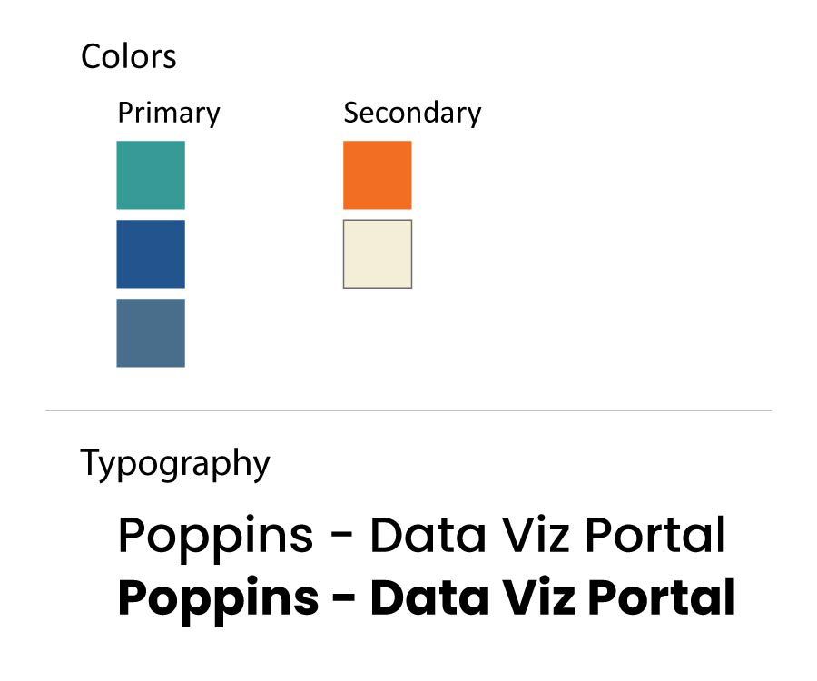
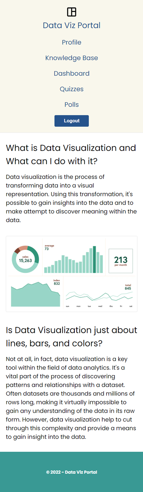

## UX Design

The design for the website focused on simplicity of layout and clarity of the content. To this end, the website only included a header, a footer, and a main content area. The design focus was placed more on content and usability. Forms used for the signup, login, quiz, and polls emphasized a clean layout and attractive UI elements. Other aspects of the design included the color palette and the typography. The color palette aimed to be modern and have a futuristic feel. The typography used only one font - [Poppins from Google Fonts](https://fonts.google.com/specimen/Poppins) - for headings and body text with the aim of creating a modern feel and maximizing readability.

{:class="project-detail-image--full"}
{:class="project-detail-container"}

Data Viz Portal - Design Options
{:class="project-detail-caption"}

The design also accounted for use on multiple screen sizes and orientations. The website design is optimized for both desktop and mobile usage. Elements such as the layout and text sizing will adjust depending on the device and screen sizing. This guarantees a good user experience no matter how a user chooses to access the website.

{:class="project-detail-image--half"}
{:class="project-detail-container"}

Data Viz Portal - Project Website Mobile Homepage
{:class="project-detail-caption"}

The website logo is also designed with minimalism in mind. The logo adopts a Google Font icon for a data dashboard. It's use is meant to imply simplicity and the arrangement of data within a dashboard space.
