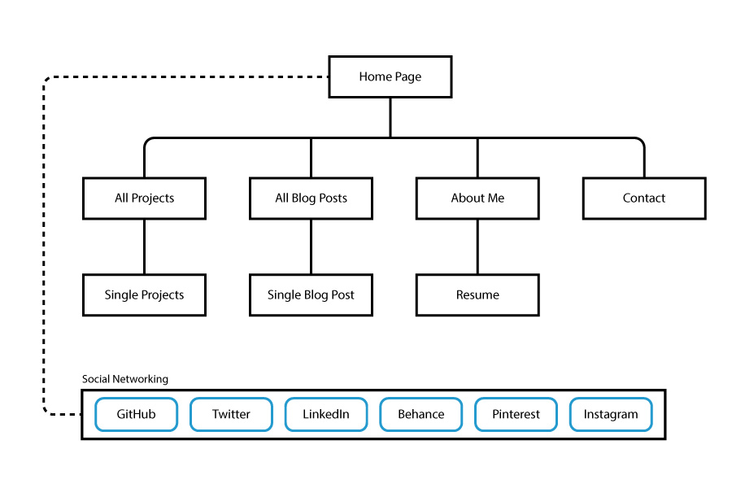

## Information Architecture

The website structure and major content areas formed the backbone for the website design. The major components of the website are the blog and projects. The website's purpose is to showcase examples of work in the projects and provide commentary and reflection on important issues in web design/development in the blog. Other important components of the website are contact, biographical and resume information. Finally, pages that group content based on categories and tags have been added, although they weren't considered in the initial sitemap. Important social media account links were included in the original sitemap.

{:class="project-detail-image--half"}
{:class="project-detail-container"}

Sitemap
{:class="project-detail-caption"}