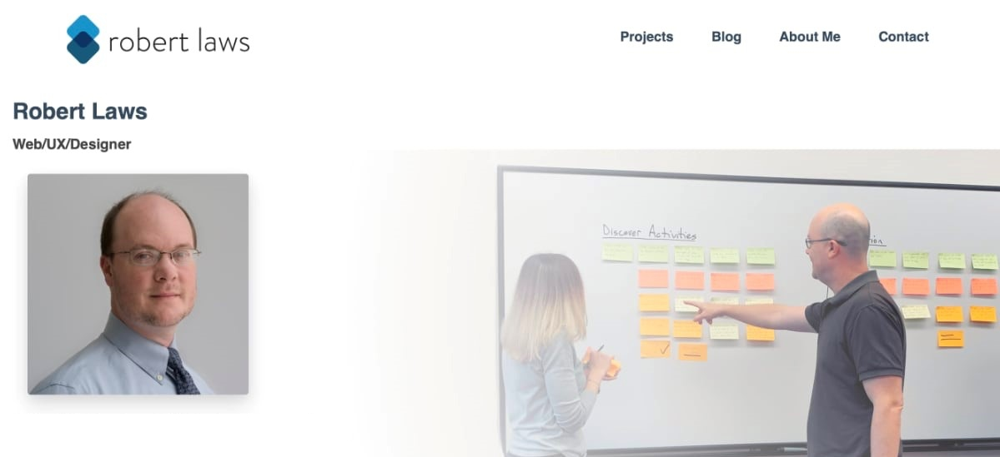

## Introduction

#### The backstory

I've been working with code for nearly 20 years. My primary job during those 20 years has been as a librarian. Traditionally, librarians have come to coding due to a need as libraries become more and more dependent on technology within their field. I've gotten to the point where my interest in coding outweighs my interest in librarianship and I'm ready to transition into coding full-time.

#### The Problem

Throughout my career, I've spent a lot of time reading code, writing code, and helping others with coding tasks. This is fulfilling, but after the work was done I didn't have a lot to show for my efforts as a coder. The problem this creates is that as an aspiring full-time web developer I need some way of recording and showcasing my work product.

#### The Solution

To remedy this situation, I've decided to develop a developer portfolio website. The goal of this website will be to provide a space for me to describe in detail my developer projects. It will also provide me a space to blog about my web developer experience and ideas. And finally, the website will include a space for my professional details - including a resume, contact information, and social media links.

{:class="project-detail-image--full"}
{:class="project-detail-container"}

Project Website Home Page
{:class="project-detail-caption"}

#### Technologies Used

I hadn't done too much work with a Static Site Generator (SSG) - this project gives me this opportunity. The benefits of a SSG are many, including diminished security risks, fast page loads, and use of sophisticated and well-supported software. I chose Jekyll as the main technology for this project - primarily because it is supported on GitHub Pages, where I want to host the site. Since I will likely be the only person working with the codebase, the limitations of using a SSG are not so significant. The content will mostly be written with markdown - and it's good to get into regular use of markdown, so that's an added bonus.

#### Requirements and Considerations

The list below reflects a preliminary assessment of the likely system requirements for the project. It's anticipated that most of the preliminary requirements will be incorporated in the final requirements although possibly with some modifications. Additional requirements will be added that are necessary for the system to function properly. The listed requirements are meant to be as comprehensive as possible to reduce the amount of additional requirements added later.

* The project will consist of a website accessible through an HTTP address and will be viewable on desktop, tablet, and mobile devices with each offering an appropriate user experience.
* The website will have a home page that will offer navigation to important sections of the website, including projects, a blog, and professional information about the author. The homepage will also offer users "previews" of project and blog content through short lists with excerpts.
* The projects page will include a list of all the projects contained within the website, allowing users to select a project to view its details.
* The project detail page will include a contextual navigation that lists the components of the project and allow users to access those sections upon clicking the link.
* The project detail page will mix textual and visual content.
* The blog page will include a list of all the accessible blog posts beginning with the most recent.
* The blog post page will mix textual and visual content.
* The blog post page will include the minimum content of author, date, title, and post text for each post.
* Blog posts will have categories and tags listed when appropriate.
* The website will include a feature to allow users to view blog posts based on selecting categories and/or tags.
* The project and blog page will include pagination to allow users to view projects and blog posts in smaller numbers and proceed to another page to view more.
* The website will include space for 'about me', resume, and 'contact me' sections.
* The website will allow for speedy updating by utilizing a technology stack that favors this type of functionality.
* The website will have a contemporary look and feel.