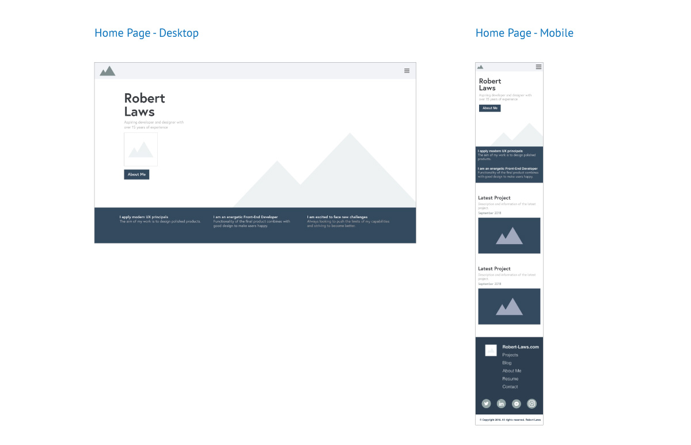
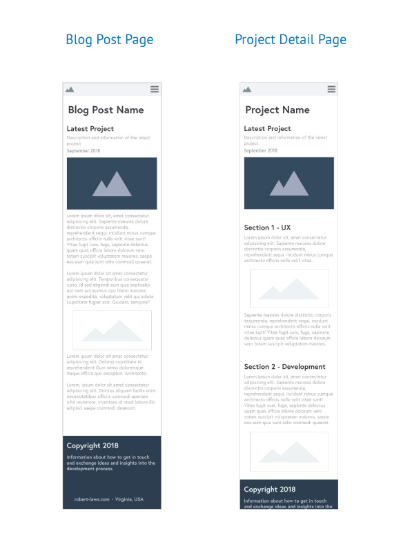

## UX Design

#### Wireframes

The UX Design phase focused on creating a design for the website that was distinctive, professional, and easy to navigate. The site isn't overly complex, but still needed to have a well thought-out design. Using the sketches and sitemap from the exploration and information architecture phases, wireframes were built. A desktop and mobile version of the home page were developed as were a mobile version for the blog post and project detail pages. Adobe XD was used to create the wireframes for this project.

{:class="project-detail-image--three-fourths"}
{:class="project-detail-container"}

Wireframes - Home Page - Desktop and Mobile
{:class="project-detail-caption"}

{:class="project-detail-image--half"}
{:class="project-detail-container"}

Wireframes - Blog Post and Project Detail
{:class="project-detail-caption"}

#### Content and Style Guide

The content and style guide was created to give clarity to the finalized guidelines that would be used for the website. This was especially important for the branding and logo design.

[Developer Portfolio - Content and Style Guide - PDF](../../assets/doc/project/developer-portfolio-style-guide.pdf)