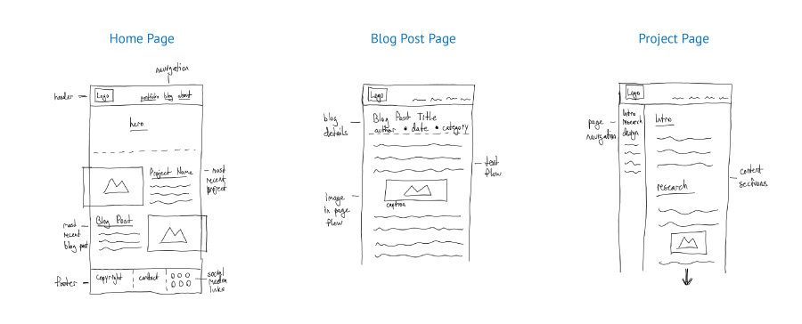

## UX Exploration

Before beginning the full design phase, exploration is very helpful for refining initial ideas. This process allowed me to "visually catch" some important considerations that impact the design - especially spacing, important content pieces, and a rough idea of how imagery and text will be laid out together.

{:class="project-detail-image--three-fourths"}
{:class="project-detail-container"}

UX Exploration
{:class="project-detail-caption"}