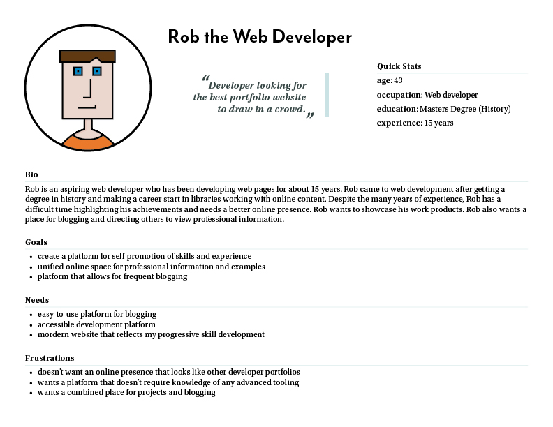

## UX Research

The project phase for UX Research was somewhat protracted since the website is mostly for my personal promotion and blogging. The primary users of the website are myself as a developer and potential employers or fellow developers. However, an extended UX Research phase is useful in the future since the website is similar to other general blogging or informational websites.

#### Personas

The persona for the website is based on myself as the developer. The core aim of the persona is to have an effective self-promotion tool via a website.

{:class="project-detail-image--half"}
{:class="project-detail-container"}

UX Research - Persona
{:class="project-detail-caption"}