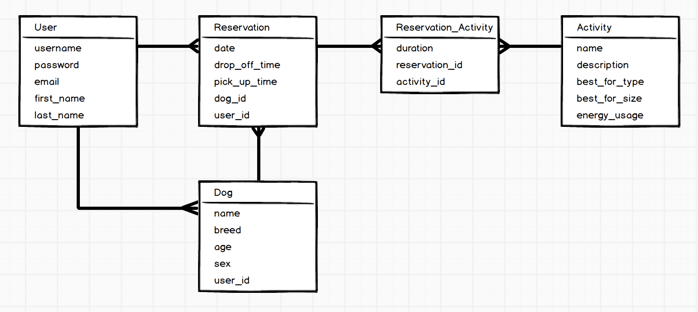
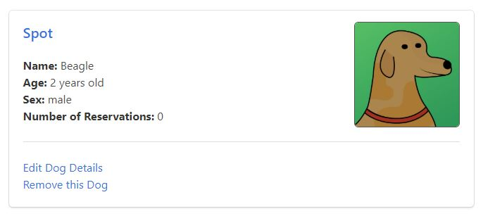

## Development

This website was developed to meet specific requirements including:

* use of the ruby-on-rails web framework
* user authentication with secure passwords
* optional user authentication via OmniAuth
* a relational database back-end and execution of CRUD actions
* web interface that supports filter actions

#### Database

The database made use of several related tables. The reservation table was set up with associations to users and through the reservations users and dogs were associated with activities.

{:class="project-detail-image--full"}
{:class="project-detail-container"}

Entity Relationship Diagram for Dog Daycare
{:class="project-detail-caption"}

#### Classes

There were several classes required of which the User, Dog, and Reservation classes made up the backbone of the application. Within each class - as is standard in ruby development - specific relationship, data validations, scopes, and class methods are stated.

```ruby
class Activity < ApplicationRecord
  has_many :location_activities, dependent: :destroy
  has_many :locations, through: :location_activities
  has_many :reservation_activities, dependent: :destroy

  validates :name, presence: true
  validates :description, presence: true
  validates :best_for_size, presence: true
  validates :best_for_type, presence: true
  validates :energy_usage, presence: true

  scope :uniq_values, ->(column){ distinct.pluck(column).delete_if{|e| [] << e if e == "custom"}.sort }
  scope :all_except_custom, -> { where("custom = ?", false) }

  def self.by_select(which_column, value)
    where("#{which_column} = ?", value)
  end

  def self.activity_columns
    ["best_for_size", "best_for_type", "energy_usage"]
  end

  def self.top
    joins(:reservation_activities).group('activities.id').having('count(activity_id) > ?', 0).order('count(activity_id)').reverse.first
  end
end
```
from app/models/activity.rb class
{:class="project-detail-caption--code"}

#### Controllers

The controllers mediate the actions between the user manipulating the view and the class models and database. A typical controller action is to allow a user to issue a create CRUD action on a database table. In the dog daycare application a user can create a dog and associate it with their user. The controller oversees this transaction.

```ruby
def create
  @dog = Dog.new(dog_params)
  if @dog.save
    redirect_to user_path(@dog.user), notice: "New dog successfully added to your account"
  else
    render :new
  end
end
```
from app/controllers/dogs_controller.rb
{:class="project-detail-caption--code"}

#### Views

Users interact with the application through views. The views employ Embedded Ruby (ERB) to inject ruby code into the view which are rendered and presented to the user. A typical scenario is linking users to different views for editing their user account information. To retain the correct user information when navigating to new views, ERB is used to pass a @user object around from view to view.

```erb
<div class="column is-one-third">
  <article class='box'>
    <h4 class="title is-5">Account Actions</h4>
    <p><%= link_to 'Edit Your User Account', edit_user_path(@user) %></p>
    <% if @user.addresses.size > 0 %>
      <p><%= link_to 'Edit Address Details', edit_user_address_path(@user, @user.addresses.first) %></p>
    <% else %>
      <p><%= link_to 'Add a New Address', new_user_address_path(@user) %></p>        
    <% end %>
    <p><%= link_to 'Add a New Dog', new_user_dog_path(@user) %></p>
    <% if current_user.dogs.size > 0 %>
      <p><%= link_to 'Add a New Reservation', new_user_reservation_path(@user) %></p>
    <% end %>
    <p><%= link_to 'View the Most Popular Activity', activities_top_path %></p>
  </article>
</div>
```
from app/views/users/show.html.erb
{:class="project-detail-caption--code"}

#### Routing in Ruby on Rails

Routing in Ruby on Rails is built upon the RESTful approach. This allows predictability for the most common types of user interactions. It also allowed the application to prevent user access to particular RESTful actions since Ruby on Rails will prevent routing to unauthorized paths. This was helpful to control how such application information like reservations was accessed and modified. Nested routes allowed reservation content only to be created or edited via a nested user route, otherwise the route would be unauthorized.

```ruby
# users
resources :users, only: [:index, :show, :new, :create, :edit, :update] do
  resources :addresses, only: [:show, :new, :create, :edit, :update]
  resources :dogs, only: [:show, :new, :create, :edit, :update]
  resources :reservations, only: [:show, :new, :create, :edit, :update]
end
```
from config/routes.rb
{:class="project-detail-caption--code"}

#### User Interface Styling

The user interface styling was achieved with the [Bulma CSS Framework](https://bulma.io/). Bulma was chosen for it's modern look & feel and modular structure. A particularly interesting component of Bulma for this application was the [card component](https://bulma.io/documentation/components/card/). This component had a polished presentation and was highly customizable.

{:class="project-detail-image--half"}
{:class="project-detail-container"}

Bulma Card - Dog information from user profile page
{:class="project-detail-caption"}

The ERB code used to create this allowed for dynamic display of the component based on finding associated dogs to a user.

```erb
<div class='column is-half'>
  <h4 class="title is-4">Dogs</h4>
  <% if @dogs.size > 0 %>
    <% @dogs.each do |dog| %>
      <article class='box'>
        <h4 class='title is-5'><%= link_to dog.name, user_dog_path(@user, dog) %></h4>
        <%= image_tag('dog_profile.jpg', alt: 'Dog Profile Image', class: 'is-pulled-right user-dog-image') %>
        <p><strong>Name:</strong> <%= dog.breed %></p>
        <p><strong>Age:</strong> <%= years_old dog %></p>
        <p><strong>Sex:</strong> <%= dog.sex %></p>
        <p><strong>Number of Reservations:</strong> <%= dog.reservations.size %></p>
        <hr>
        <p><%= link_to 'Edit Dog Details', edit_user_dog_path(@user, dog) %></p>
        <p><%= link_to 'Remove this Dog', dog, method: :delete, data: { confirm: "Are you sure?" } %></p>
      </article>
    <% end %>
  <% else %>
    <article class="message is-danger">
      <div class="message-body">
        No dogs found...
      </div>
    </article>
  <% end %>
</div>
```