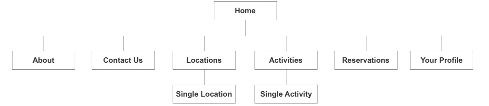

## Information Architecture

The structure of the website is not overly complex. It consists of a home page, which is contextual based on a user being logged in or not. An about and contact pages - which are static pages. The activities and locations pages are interactive and allow the user to view activities or locations based on several filters. Finally, the reservations and profile pages are contextual based on the user login.

{:class="project-detail-image--three-fourths"}
{:class="project-detail-container"}

Sitemap
{:class="project-detail-caption"}