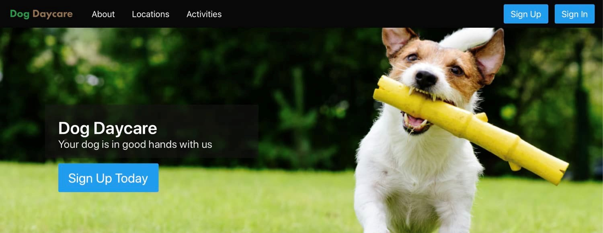

## Introduction

This project was created as one of my Flatiron School development course assignments. The purpose of this project was to use the ruby-on-rails framework to create an interactive website backed with a PostgreSQL database. The project also required use of OmniAuth for authentication and retrievable user profiles.

#### Purpose / Vision

This is a website that allows dog owners to find a dog daycare center, select dates and make reservations, and choose from a range of activities available to entertain the dog during their stay.

#### Overview

Users create an account with their personal and dog information. Once they create their account and authenticate, users are able to make a reservation on a specific date and select what activities their dog should have during the day. Users submit their selections and receive confirmation. A separate administration section allows an admin user to add locations, dates available, and activities available that users can then select.

{:class="project-detail-image--full"}
{:class="project-detail-container"}

Project Website
{:class="project-detail-caption"}

#### Requirements

The following requirements formed the baseline of functionality for the initial release of the project.

* Users must be able to sign-up through a form on the website.
* Users must be able to sign-in through a form on the website using either login credentials or a linked account.
* Users must be able to view their profile and edit it
* Users must be able to add or delete one or more dogs to their account
* Once a user has one or more dogs associated with their account, they must be able to create reservations for any of their dogs.
* When creating a new reservation, a user must be able to add zero to all available activities to the reservation as add-ons.
* When creating a new reservation, a user must be able to add a custom activity to their reservation.
* A user must be able to delete a reservation.
* The website must allow users to view and perform filtering on listed locations and activities.