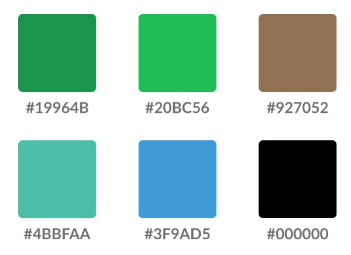
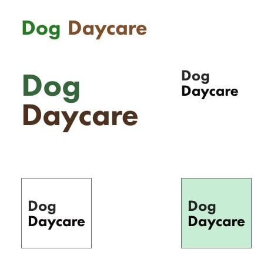

## UX Design

The UX Design phase built on the UX Research phase and incorporated design into development of functionality that users desired. The color palette aimed for a bright and "earthy" look and feel. The logo and typography aimed to bring a modern and clean design to the website.

#### Color Palette

The colors chosen are bright and "earthy". The aim is to evoke a welcoming feel with the bright colors. The earth tones are meant to connect the daycare services to the outdoors and suggest to users that many of the activities will provide dogs with outdoor time and activities.

{:class="project-detail-image--quarter"}
{:class="project-detail-container"}

Color Palette
{:class="project-detail-caption"}

#### Logo and Typography

The logo used for the branding is a simple use of the words Dog Daycare and making use of two earth tones from the color palette. There is a vertical version as well, which appears in the footer. The typography used for the logo is Futura PT. Headings and body text is Roboto.

{:class="project-detail-image--quarter"}
{:class="project-detail-container"}

Logo and Typography
{:class="project-detail-caption"}