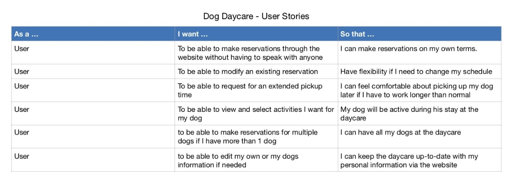

## UX Research

The User Experience Research phase of the project focused on the development of personas, user stories and scenario mapping.

#### Personas

Several personas were developed of potential users of the website Dog Daycare. A common thread for the personas was dog owners who wanted to use a dog daycare service with the advantages of an online space to schedule and customize their usage.

{:class="project-detail-image--full"}
{:class="project-detail-container"}

Project Persona - Potential User of Dog Daycare
{:class="project-detail-caption"}

#### User Stories

The user stories were informative of the expectations that a typical user would have for the website. The user stories revealed that the website should have lots of options and give dog owners the ability to fit the service to their specific situations.

{:class="project-detail-image--three-fourths"}
{:class="project-detail-container"}

User Stories
{:class="project-detail-caption"}

#### Scenario Mapping

Was built by focusing on several essential features of the website and how users would approach them. Detailed below is the user discovery process of activities available for dogs at the daycare locations.

{:class="project-detail-image--three-fourths"}
{:class="project-detail-container"}

Scenario Mapping - Activities Discovery
{:class="project-detail-caption"}