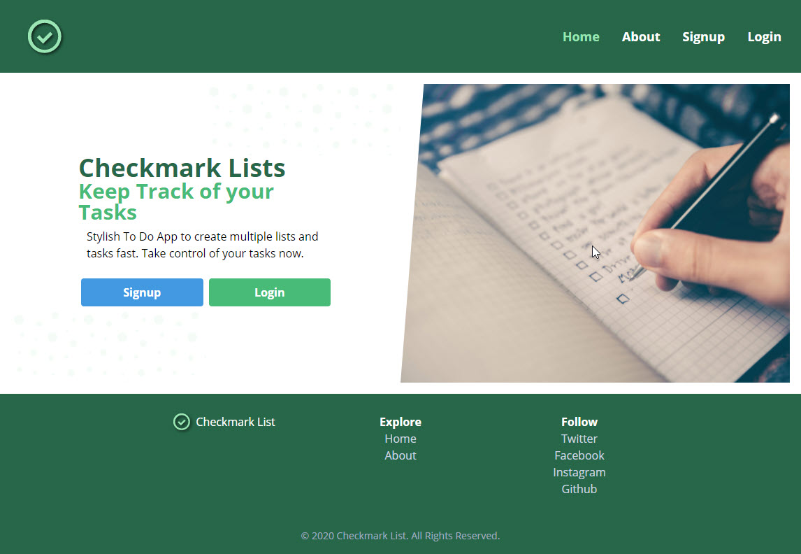

## Introduction

#### The backstory

I want to develop a simple app to practice my command of front-end and back-end concepts in conjunction with React. A To Do App is very common for these types of projects.

#### The Problem

Attempting to challenge myself, I'm making use of a few different technologies including some of the latest features available from React. Working with state, in particular, can be challenging. React's Context API is meant to simplify this aspect of the app. Using Context, state can be collected into one provider and made available to components at any stage of the app. Firebase provides a way to manage users and store data with a rich javascript API. And Tailwind CSS is a flexible and non-intrusive CSS framework that allows for attractive styling.

#### The Solution

A simple To-Do App that allows a user to login and view, create, update, and delete their To-Dos. Each To-Do list can have keywords that are used as flags and group together multiple lists.

My To Do app is not anything radically different than similar apps. It allows a user to create an account and log in. Once logged in, users can create a new To Do list, add tasks to the list, view To Do lists and tasks, update To Do list titles and the text of tasks, and delete To Do lists and/or tasks. Each To Do list can also have tags associated with it, which can be used to group different lists together.

{:class="project-detail-image--full"}
{:class="project-detail-container"}

Checkmark List App Home Page
{:class="project-detail-caption"}

Making use of Firebase Auth will provide an easy solution for user sign up and authentication. Firestore will allow for content to be saved to a data file and retrieved when requested. React will act as the user interface for user interactions and rendering content. The app makes use of the React Hooks libraries, including the Context API to maintain state throughout use of the app. Finally, Tailwind CSS is good for handling the styling of UI layout and components.

The app supports user browsing to a handful of different pages. The react-router-dom package adds this functionality to the app.

#### Technologies Used

Being a To Do List app, the technologies used were fairly standard. For the user interface, I employed React with Tailwind CSS. Navigation and routing was handled with React Router Dom. The app connects to a Firebase database. And finally, state is managed by React's Context API.

- React
- Tailwind CSS
- React Router Dom
- Firebase
- Context API

#### Requirements and Considerations

The list below reflects a preliminary assessment of the likely system requirements for the project. It's anticipated that most of the preliminary requirements will be incorporated in the final requirements although possibly with some modifications. Additional requirements will be added that are necessary for the system to function properly. The listed requirements are meant to be as comprehensive as possible to reduce the amount of additional requirements added later.

- Users will be able to sign-up and login to the App
- Users will be able to sign-out of the App
- Users will be able to view a list of options from the Home page
- Users will be able to view their Profile and update fields
- Users will be able to create To-Do Lists, each with a title
- Users will be able to view, update, and delete their lists
- Users will be able to add tasks to their lists
- Users will be able to view, update, and delete tasks from their lists
- Users will be able to add one or more Keywords to their lists
- Users will be able to view lists grouped by keywords
- The App will include an About page describing the App
