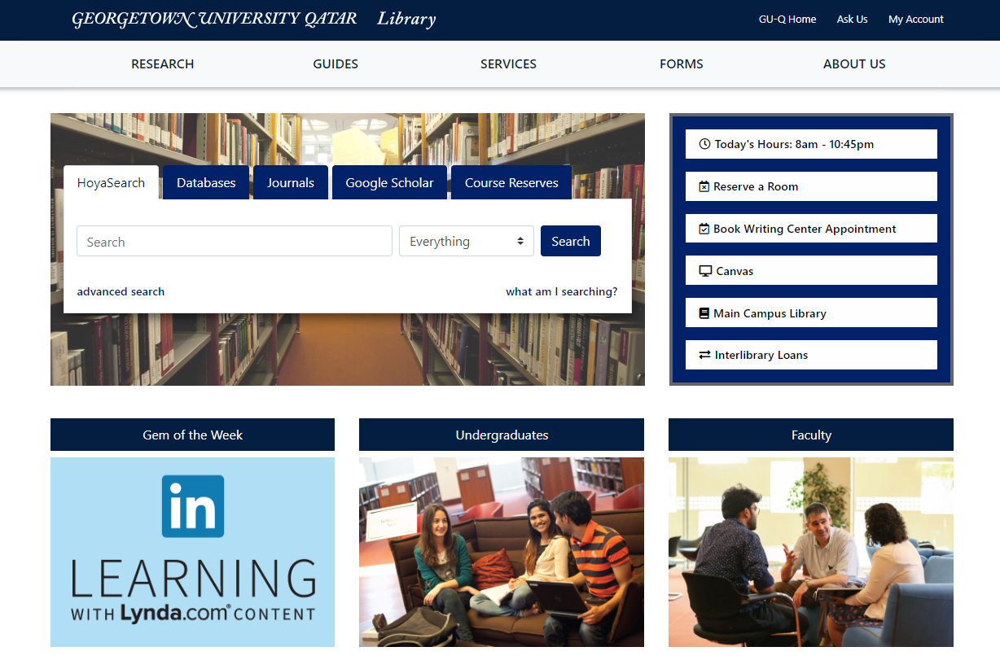

## Introduction

...

#### The Challenge

...

#### The Solution

...

---

{:class="project-detail-image--full"}
{:class="project-detail-container"}

Library Website - Project Website
{:class="project-detail-caption"}

#### Requirements

The following requirements formed the baseline of functionality for the initial release of the project.

- Must have a final implementation using Drupal
- Must implement accessibility standards for use by screen-readers
- Must be responsive, allowing for ease of use on tablet and mobile devices
- Must have solutions to route users to external resources via search boxes, links, etc.
- Must implement a corporate design in the look & feel of the website
