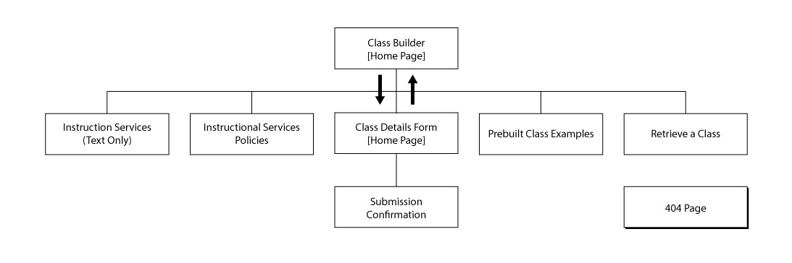
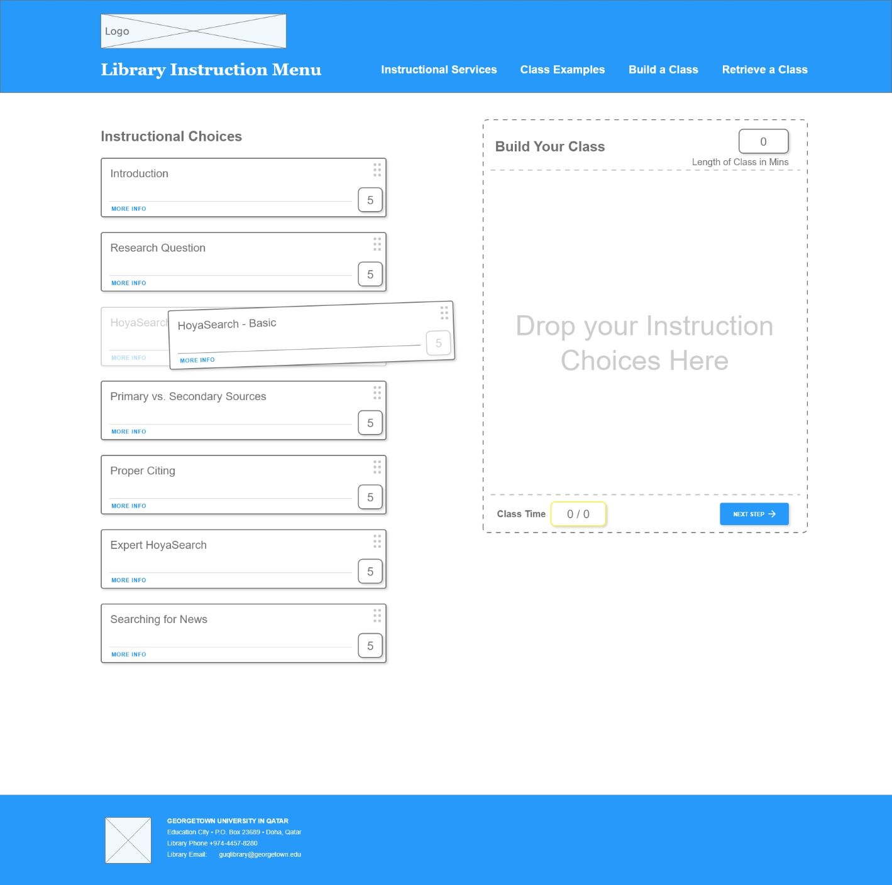
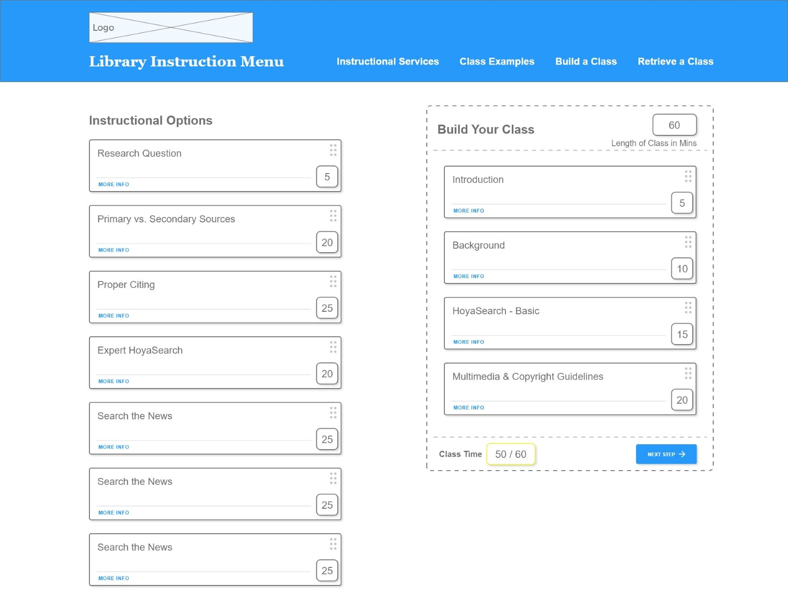
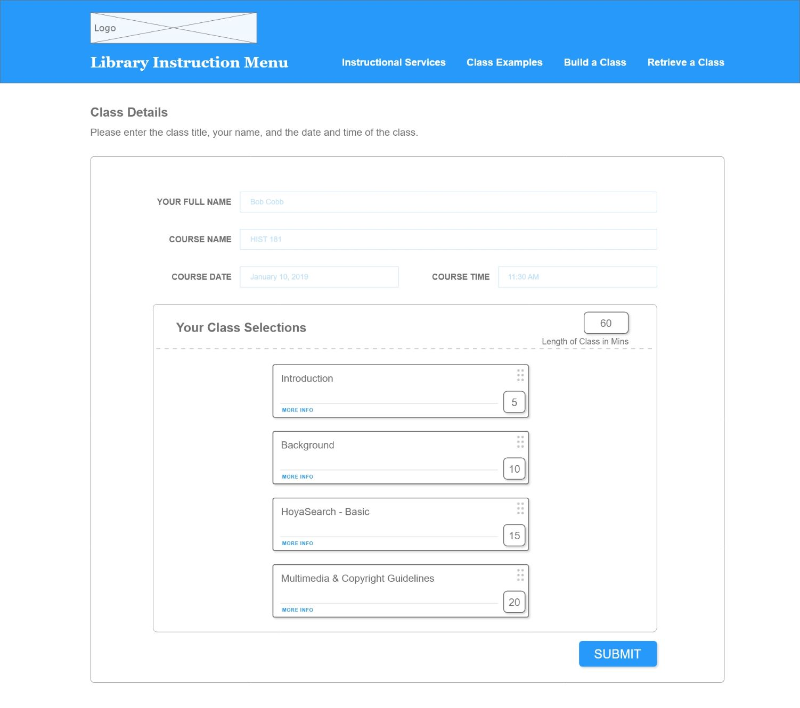
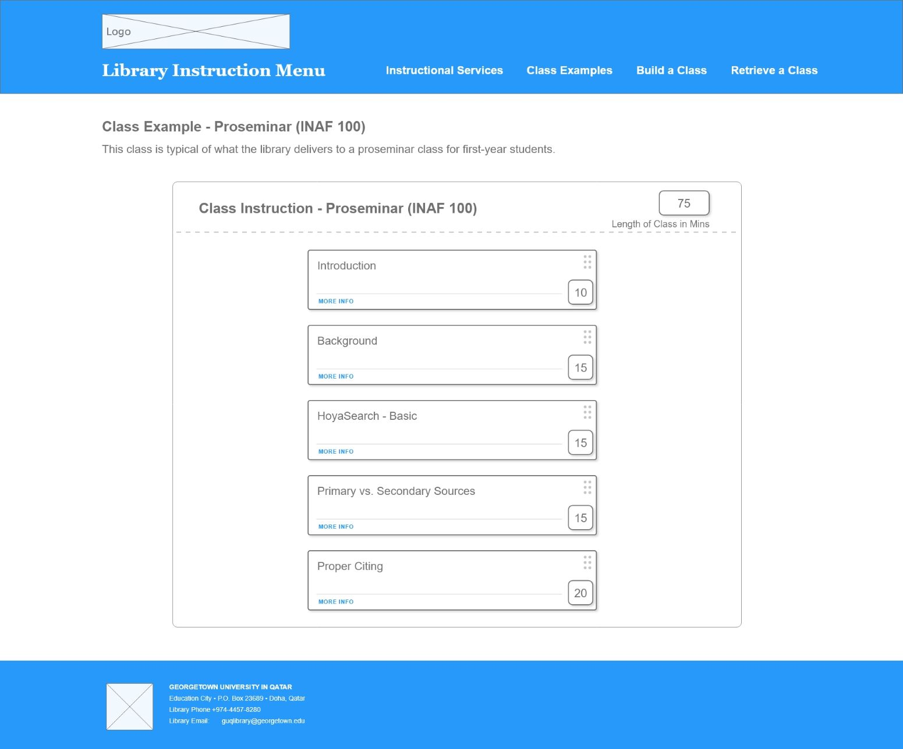
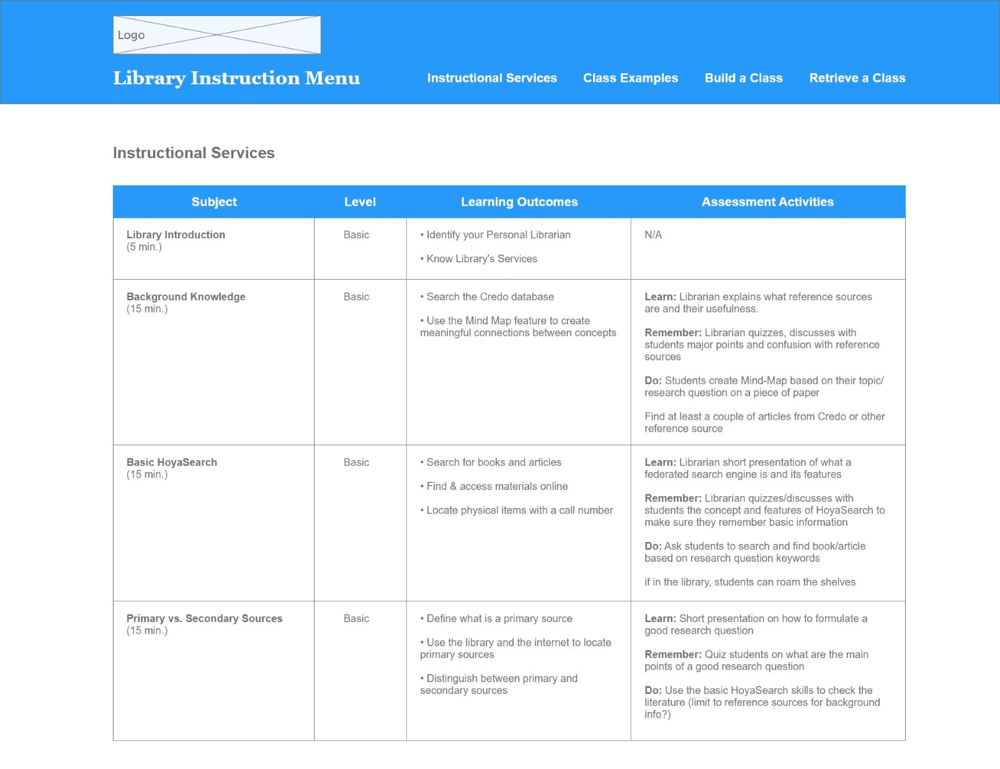
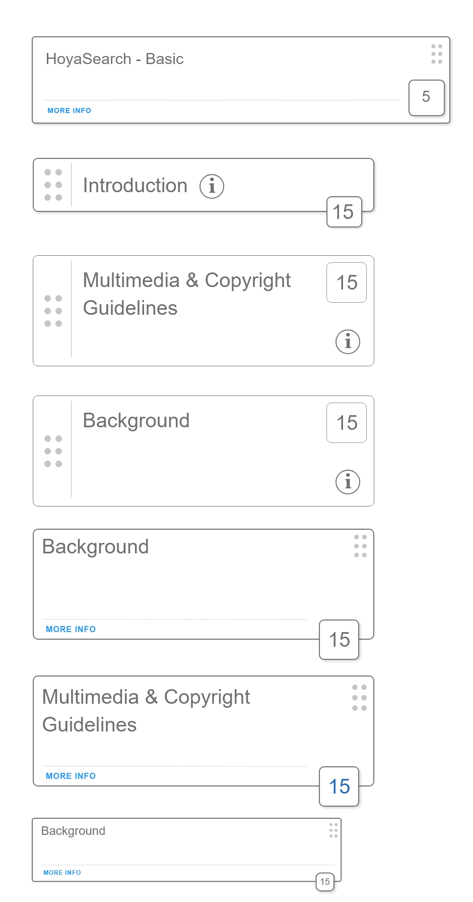

## Information Architecture

Information architecture provides a detailed listing of the structure and makeup of the website. Included are the sitemap, which describing site structure and relationships and wireframes, which describe page structure.

#### Sitemap

The website will consist of a few informational pages:

* Text only version of the instructional services

* The library instructional services policy

Interactive pages:

* The class builder tool

* A web form for the instruction request details

* A web form to retrieve a previously built class

And example pages:

* Prebuilt class examples

The website will also have an 404 error page for content not found

The home page will either be the web form for instruction details or the class builder tool.

{:class="project-detail-image--half"}
{:class="project-detail-container"}

Information Architecture - Sitemap
{:class="project-detail-caption"}

#### Wireframes

The wireframes reflect the major components of the website - the class builder process, the sample class examples, and the instructional services in a data table. The major component of the class builder is a drag and drop concept. Some variations on the drag and drop component were also developed.

##### The Starting Page

A user encounters the class builder with some instructions to drag an instruction component from the left side to the right side in the drop zone.

{:class="project-detail-image--half"}
{:class="project-detail-container"}

Starting Page
{:class="project-detail-caption"}

##### Building the Class

Once the user has begun to add components the drop zone the class begins to stack. The components can be reordered to reflect a sequence for instruction.

{:class="project-detail-image--half"}
{:class="project-detail-container"}

Building the Class
{:class="project-detail-caption"}

##### User Input

Once the user has finished building a class, the next button will bring the user to a details form, where information about the class date, time, etc. is collected.

{:class="project-detail-image--half"}
{:class="project-detail-container"}

User Input
{:class="project-detail-caption"}

##### Pre-filled Class Examples

Users can also view prebuilt class examples and potentially use it directly for a class they want to request.

{:class="project-detail-image--half"}
{:class="project-detail-container"}

Pre-filled Class Examples
{:class="project-detail-caption"}

##### Instructional Services

Users can also view a text-only version of the full catalog of instructional services via a data table.

{:class="project-detail-image--half"}
{:class="project-detail-container"}

Instructional Services
{:class="project-detail-caption"}

##### Drag and Drop Component Development

Various concepts were developed for the drag and drop component as part of the wireframe exploration.

{:class="project-detail-image--half"}
{:class="project-detail-container"}

Drag and Drop Component Development
{:class="project-detail-caption"}