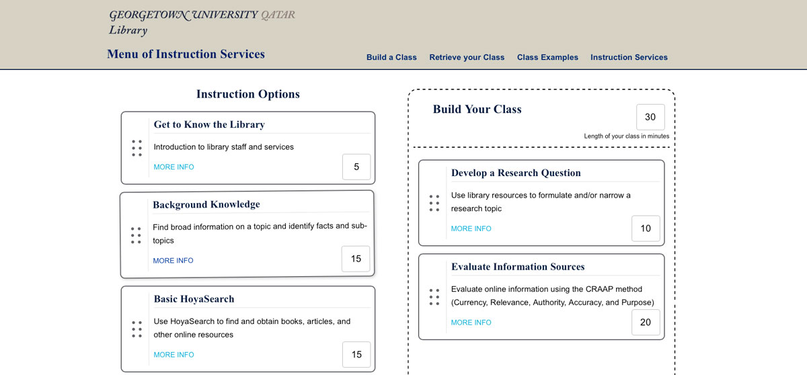

## Introduction

#### The Backstory

The university library provides instructional services to help students make the best use of the library's resources and knowledge. This service includes in-class instruction for a variety of different information and/or digital literacy needs. The needs of the students vary depending on the experience of the students and the nature of the assignments they're given. The library wants to provide better communication about what services it can provide and give professors the ability to review and select distinctive segments to include in an information literacy instruction session.

#### The Problem

Previously librarians met with professors to discuss the possible areas of instruction. The conversations were useful but not necessarily comprehensive in discussing the possible instruction offerings. Sometimes librarians or instructors would not communicate what was needed or possible. This sometimes resulted in either an instruction session that missed some key areas that were important for student understanding or an instruction session that had a disconnect between what the professor wanted and what the librarian thought was needed.

Another issue is that librarians need a tool that helps to organize what the library is offering as instructional services. Statistical information is needed to help librarians better understand what instructional services are most utilized.

#### The Solution

To solve this problem, the library is proposing to create a menu of instructional services. The menu of services will provide a visual and interactive online space for professors and librarians to view what instructional services are available, devise lesson plan outlines, and determine the order and length of instruction. The solution will also include the capability of professors and librarians to create customized instruction plans and export those plans either by email and/or print.

The website will also save statistical information that can be reviewed to see what instruction is most popular. This will help librarian future planning.

{:class="project-detail-image--full"}
{:class="project-detail-container"}

Project Website Home Page
{:class="project-detail-caption"}

#### Technologies Used

This project gave me the opportunity to use some older technologies - like JQuery and PHP. Although there are newer and more interesting approaches in modern web development such as using a Javascript Framework, I wanted to take a straight-forward approach. The website isn't overly complex either, therefore I didn't want to invest time in setting up a development environment for a modern framework.

In the end, I used a development environment running via Gulp that processed both Pug and Sass along with Javascript files into a final `dist` application directory.

For the data structures I use JSON and JQuery to return them via the `.getJSON` function. When writing to the JSON file, I use PHP to run a server-side process.

#### Requirements and Considerations

##### Content

* Must include an introductory page with a basic overview of the website and instructional service

* Must include all information literacy discreet skill instruction available from the library

* Must include descriptive information about each information literacy skill instruction including:

  * title
  * length of time to teach
  * learning outcomes
  * skill level category (color coding can be used)
  * assessment
  * color coding depending on type of instruction (ex. IL or technology)

##### Display / UI

* There a minimum of three pages - plus a thank you page upon submission

  * An introductory page with basic information about the site, it's purpose, and capabilities
  * A page with descriptive information about each instructional option available
  * A page with a form and the results of instructional selections

##### Functionality

* The website offers the ability to fill out information about the instructional request including:

  * title of course
  * name of the requesting professor
  * date and time of the instruction requested
  * length of instruction requested
  * number of students

* The class builder page includes the ability to select one or more discreet instructional choices

* The lesson plan review page will offer the ability to submit, email or print out the details of the instructional session choices

##### Features

* The class builder page will allow users to view detailed information about an instructional item

* Selecting an instructional item will aggregate the total time based on the number of selections made