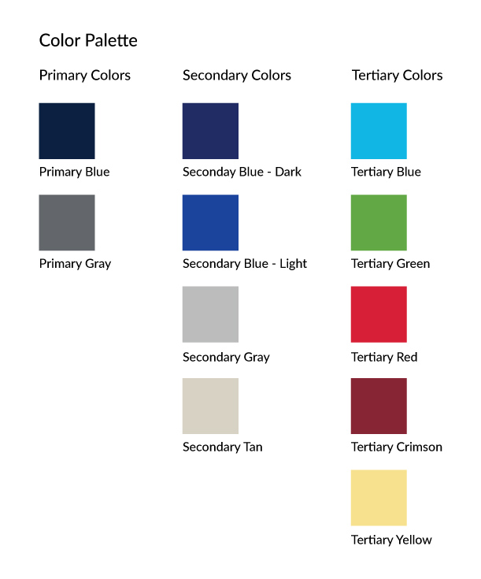
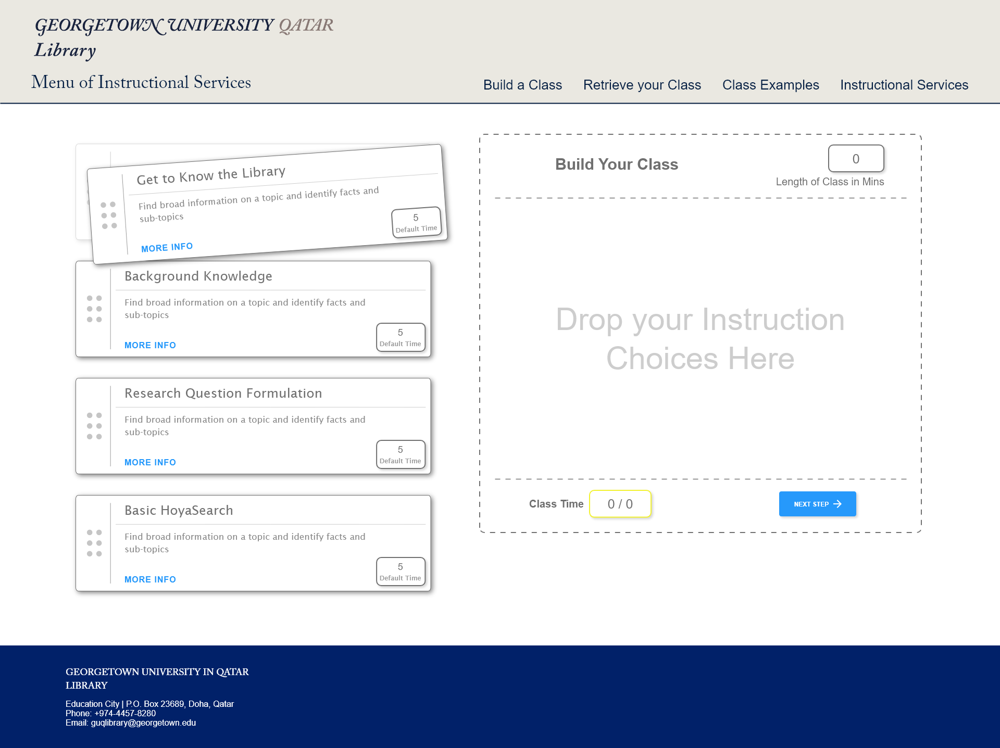
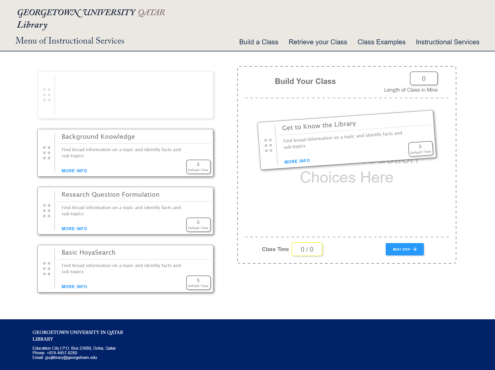
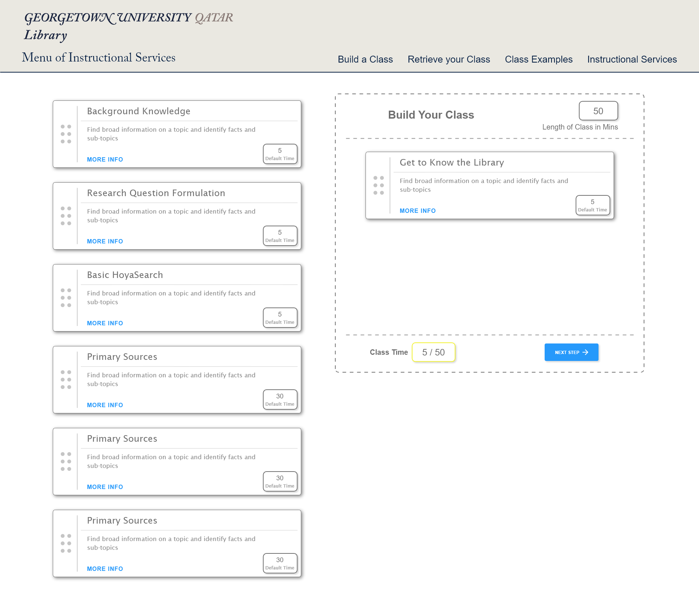
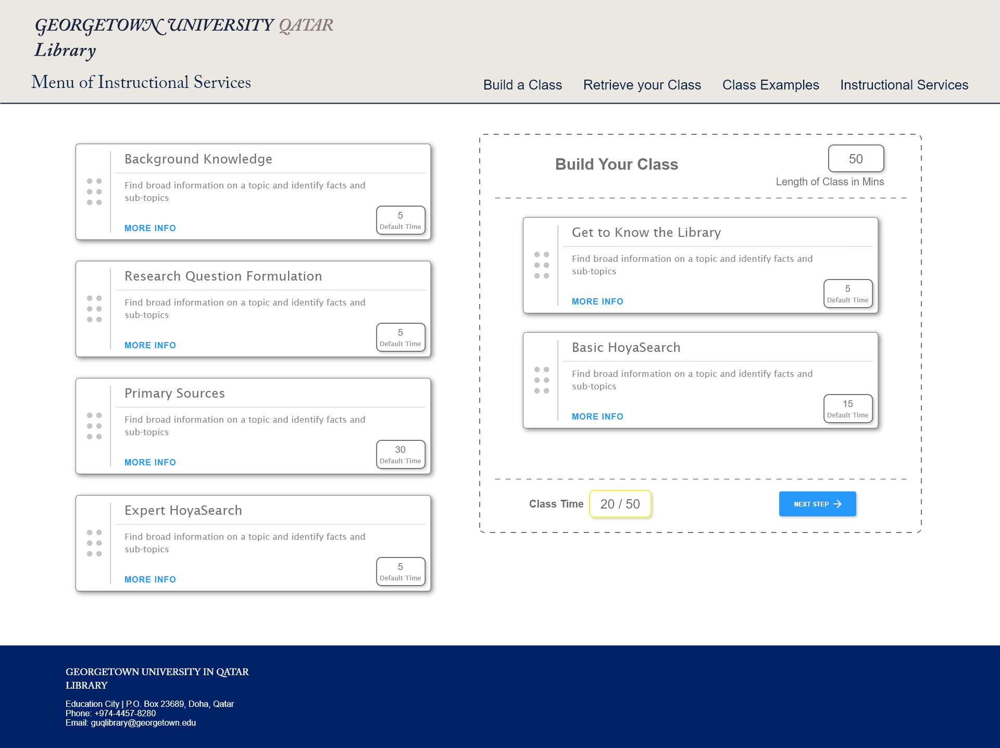
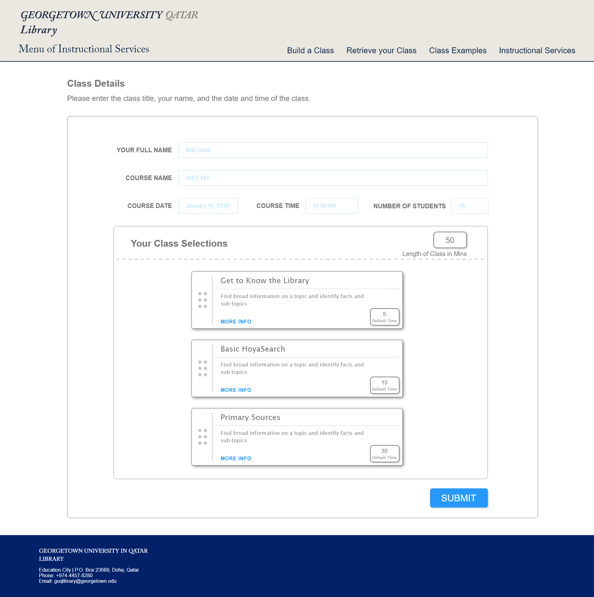
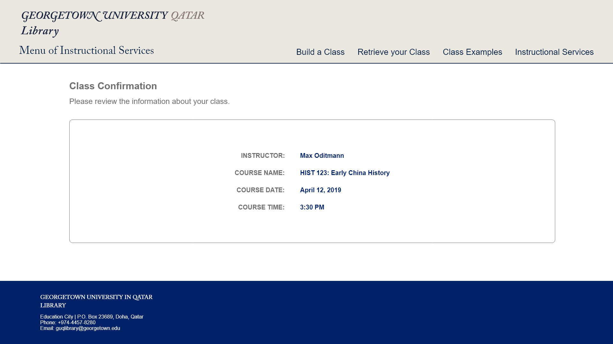
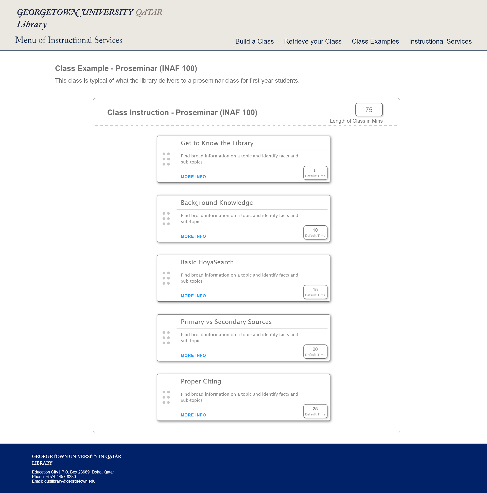
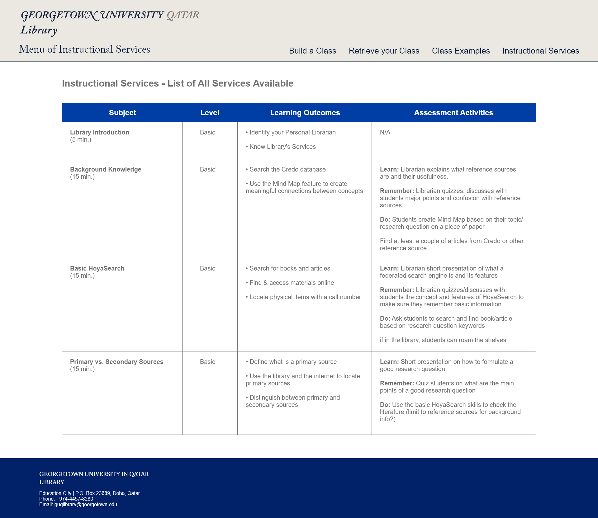

## UX Design

UX Design describes how the website will appear visually and how the User Interface (UI) will be constructed.

#### Style Guide

##### Branding

The major brand elements are adopted from the Georgetown University Library's web presence. They include the library logo and the Georgetown University seal.

##### Color Palette

The color palette for this website mirrors the [corporate color palette for Georgetown University](https://visualidentity.georgetown.edu/colors). This choice was made to be consistent with University visual identity standards.

{:class="project-detail-image--half"}
{:class="project-detail-container"}

Website Color Palette
{:class="project-detail-caption"}

##### Typography

Headings use **"Times New Roman", Times, serif**

Flow content use **Arial, Verdana, sans-serif**

#### Prototypes

The prototypes consist of the main functionality of the website's drag-and-drop class builder features.

The initial state displays the instruction options available for selection.

{:class="project-detail-image--three-fourths"}
{:class="project-detail-container"}

Prototype
{:class="project-detail-caption"}

The next step involves physically moving a selection item into the drop-zone to build a class.

{:class="project-detail-image--three-fourths"}
{:class="project-detail-container"}

Prototype
{:class="project-detail-caption"}

A selection item can be dropped into the drop-zone. There is a visual indicator that an item is being moved to a dropping position.

{:class="project-detail-image--three-fourths"}
{:class="project-detail-container"}

Prototype
{:class="project-detail-caption"}

Once the selection item is dropped it will be removed from the list of options on the left and only appear in the drop-zone area on the right.

{:class="project-detail-image--three-fourths"}
{:class="project-detail-container"}

Prototype
{:class="project-detail-caption"}

Once several selection items have been moved into the drop-zone they can be sorted. The sorting indicates their order of appearance in the instruction class.

{:class="project-detail-image--three-fourths"}
{:class="project-detail-container"}

Prototype
{:class="project-detail-caption"}

Upon completion of selecting all the desired options for the instruction, the user is presented with a review page and web form to enter more details about the class. The web form includes calender and time widgets for the date and time desired. The user will input an email address - where a confirmation email will be sent.

{:class="project-detail-image--three-fourths"}
{:class="project-detail-container"}

Prototype
{:class="project-detail-caption"}

The user will also be redirected to a confirmation page upon successful completion of the instruction submission.

{:class="project-detail-image--three-fourths"}
{:class="project-detail-container"}

Prototype
{:class="project-detail-caption"}

Prebuilt examples of instruction will be accessible via a page displaying a range of different prebuilt classes and instruction.

{:class="project-detail-image--three-fourths"}
{:class="project-detail-container"}

Prototype
{:class="project-detail-caption"}

For users who want to have one location to read detailed information for all the instruction available, there's a table that displays a comprehensive list of instruction options.

{:class="project-detail-image--three-fourths"}
{:class="project-detail-container"}

Prototype
{:class="project-detail-caption"}