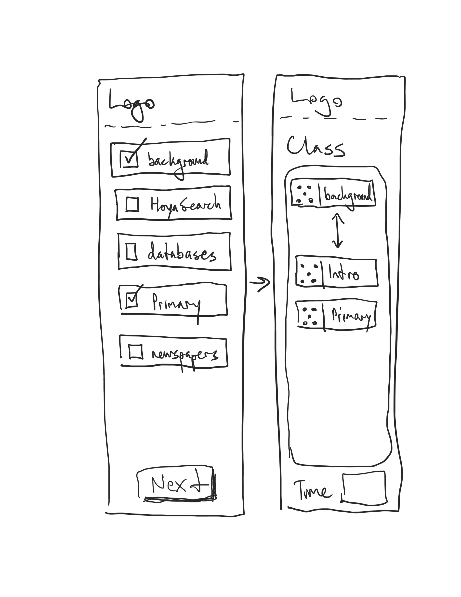

## UX Exploration

Although the website is not complex in the number of pages or the amount of features, it's important to explore different ways to envision how users will interact with the content. The core of the website is an interactive "class builder" feature that allows users to drag tiles into a drop-zone. This requires some experimentation and research to determine how best to design the UI with user needs in mind.

#### Ideation

This collaborative phase allows for wide ranging exploration of layouts, content, and features for the instructional menu website. The exploration is based on the core feature requirements identified during the research phase.

##### Header Section

The header section includes a logo for the site and navigation links - which can include informational pages about the library instruction policy, detailed listing of instructional components with learning outcomes and assessment details, the class builder tool, prebuilt examples of typical classes, and a means retrieving a previous class.

##### Class Builder - Desktop

The class builder feature will allow users to create custom lesson plan for a library information literacy instruction. Users can drag options from a list of available instructional components and drop them into a build area. The build area will show the total time for the instruction and include a submission method to keep the changes.

{:class="project-detail-image--three-fourths"}
{:class="project-detail-container"}

Ideation - Class Builder Desktop View
{:class="project-detail-caption"}

##### Class Builder - Mobile

In a mobile layout, the drag and drop feature is potentially less usable, users can use a checkbox instead to make their selections for the class. The next step will allow for drag and drop reordering.

{:class="project-detail-image--three-fourths"}
{:class="project-detail-container"}

Ideation - Class Builder Mobile View
{:class="project-detail-caption"}

##### Class Scheduling Details Form

In conjunction with a user creating a lesson plan with the class builder tool, the user will also have the opportunity to enter details about the date and time of the class, the name of the course, and the faculty member's name. The details of the lesson plan will also be available for review.

{:class="project-detail-image--three-fourths"}
{:class="project-detail-container"}

Ideation - Class Scheduling Details
{:class="project-detail-caption"}

##### Class Details - After creating a class on the website

Once a class has been created, a user can review scheduling details about the class and the instruction selections made.

{:class="project-detail-image--three-fourths"}
{:class="project-detail-container"}

Ideation - Class Detail
{:class="project-detail-caption"}

##### Submission Confirmation

A message will appear to the faculty member upon successful submission of the library instruction request.

{:class="project-detail-image--three-fourths"}
{:class="project-detail-container"}

Ideation - Submission Confirmation
{:class="project-detail-caption"}