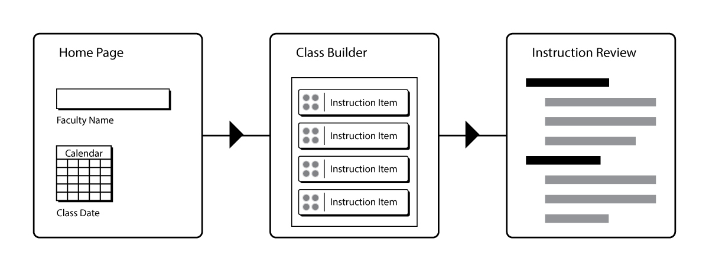
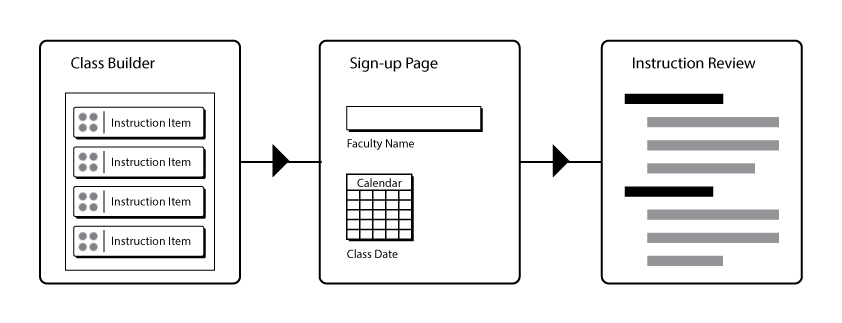

## UX Research

To better understand the potential users for the instructional menu website, user research is important. Speaking with potential users - such as professors and librarians - will help to focus the website exploration and design on the most important features wanted by users.

#### Personas

**Michael, 41**

History Professor

Biographical Information

* Identifies best with younger colleagues
* Likes to use technology with his teaching
* Uses a Mac for day-to-day computing

Key Goals

* Wants to bring library into class to support student research needs
* Wants to give assignments that require library research and resources
* Wants to encourage students to interact with library staff for research needs

I must

* Be able to have my library needs addressed by the instruction available
* Have a clear understanding of the instruction that will be delivered
* Be confident that the final instruction will meet my specific needs

Behaviors

* Will not spend a lot of time experimenting with a complex website
* Has specific goals in mind for instruction from the library
* Enjoys making use of new technologies in conjunction with teaching

I must Not

* Spend too much time fiddling with a website that doesn't get to the point fast
* Have to do a lot of searching to discover the type of instruction I want from the library
* Have to do a lot of repetitious activities to complete my main task

**Anna, 29**

Research Librarian

Biographical Information

* Adapted to using mobile technology
* Is adept with online tools and technologies
* Prefers to interact with faculty via email and online tools

Key Goals

* Provide comprehensive teaching options for faculty
* Avoid misunderstandings with faculty
* Incorporate activities and assessment in teaching

I must

* Be able to list all possible instructional options via a website
* Be able to have faculty communicate their instructional selections with me
* Have a quick way to show sample instruction scenarios to faculty

Behaviors

* Will use email as much as face-to-face interaction to plan instruction
* Will expect faculty to make use of a website to pre-plan instruction
* Promotes using new technologies to improve library services

I must Not

* Have to click too many times to show faculty examples for instruction
* Have to enter too much preliminary information to use the website key features
* Promote a website that looks out-of-date and old-fashioned

#### User Stories

|As a user ...| Detailed Story | Priority|
| --- | --- | --- |
|I can enter my name for the instructor|- Single textbox to allow faculty to choose their name format - validation should remain simple (i.e. required)|High|
|I can select a date and time for the library instructional session|- ideally will use a date/time selector widget|High|
|I can define how long my class session will be|- should mediate this selection with hours/minutes selector - could allow a total minutes input|High|
|I can view all the instructional possibilities listed in an easy-to-read way|- can incorporate this into the choices listing for the drag-and-drop elements - could create a separate page(s) to view detailed information for instruction options - aim to minimize clicking out of drag and drop page|High|
|I can drag and drop my instructional choices into a "class builder" area|- need an fun UI experience - dragging can be from a handle or the entire object - the UI should update information like total class time on drop, etc|High|
|I can remove an instructional choice from the "class builder" area|- removing choice from "class builder" box should be sufficient to complete task - UI should update on completion of removal|High|
|I can read additional details about an instructional option|- investigate using a modal for details - information should be listed in easy-to-read way|High|
|I can export the final class instruction in one or more ways|- email would be a nice option here - print view is another possibility - need to make sure work can be saved/exported in some way|High|
|I can save and retrieve the classes I build|- add a save feature option|Medium|
|I can use the website even with some accessibility limitations|- investigate use of high contrast colors - review accessibility standards|High|
|I can easily use the website on a mobile device|- design and develop with mobile users in mind|High|
|I can use the website without having to navigate between pages/refreshes|- investigate single page application (SPA) technologies|Low|
|I can use the website "offline" as if it is a mobile app|- investigate Progressive Web Apps technologies|Low|

#### User Flows

The basic user flow for the website consists of a user ...

1. Entering the website and entering their name, date of the class, time length for the instruction and any other information

1. Using the class builder tool to construct the instruction elements and order

1. Saving or exporting a finalized class structure outline

#### User Flow Diagram

{:class="project-detail-image--three-fourths"}
{:class="project-detail-container"}

User Flow
{:class="project-detail-caption"}

---

An alternative user flow consists of a user ...

1. Beginning the interaction with the class builder immediately upon entering the site, with minimal user input needed

1. Once they've built a class, then they enter their name, date of the class, time length for the instruction and any other information

1. Saving or exporting a finalized class structure outline

#### User Flow Diagram

{:class="project-detail-image--three-fourths"}
{:class="project-detail-container"}

User Flow Diagram
{:class="project-detail-caption"}
