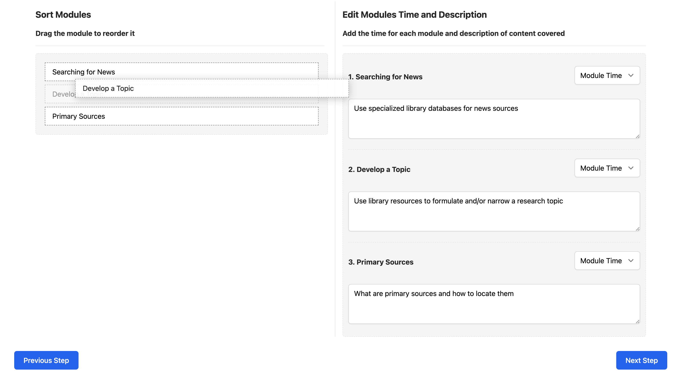

## Development

The development of the website, although it was seemingly a simple site, has several prominent challenges. The challenges include:

- implementing authentication with React and JWT
- requesting data with the WordPress REST API
- storing data in state and sharing between components with the Context API
- implementing a drag and drop feature with React-DnD
- saving lessons to WordPress using the REST API and JWT

#### Authentication with React and JWT

Since the purpose of the website is to allow librarians view and create lesson plans, these sections of the website can not be accessible to users who are not authenticated. To implement authentication with JWT, the first step was to install the [JWT Authentication for WP-API](https://wordpress.org/plugins/jwt-authentication-for-wp-rest-api/) plugin. This plugin extends the WordPress REST API to expose a new endpoint `/wp-json/jwt-auth/v1/token` to the REST API. A **POST** request can be sent, which upon success will return a token that can be stored for subsequent **POST** requests. In this application, an asynchronous request is sent to the WordPress REST API with the fetch API.

```javascript
try {
  const response = await fetch(loginUrl, {
    method: 'POST',
    body: JSON.stringify({
      username,
      password,
    }),
    headers: {
      'Content-Type': 'application/json',
    },
  });
  if (!response.ok) {
    const error = await response.json();
    // login error
  } else {
    const user = await response.json();
    const token = await user.token;
    // login success, do something with token
  }
} catch (error) {
  // handle error
}
```

#### Requesting data with the WordPress REST API

The WordPress REST API comes built-in to a WordPress installation. The documentation for the [WordPress REST API](https://developer.wordpress.org/rest-api/) is extensive and offers a lot of options for sorting and ordering data returned from the WordPress site. The following request queries the `courses` post type, for a total of 100 records per page, and specifies the fields `id`, `title`, and `acf`, which is the fields from the advanced custom fields added to courses. Finally, the request orders the results by `title` and in ascending order.

```javascript
/wp/v2/courses?per_page=100&_fields=id,title,acf&orderby=title&order=asc
```

#### Storing data in state and sharing between components with the Context API

The next part of the process is storing the data once it has been returned from the WordPress REST API. To do this, the Context API is used and enables the sharing of state data between components. Making use of the Context API requires some set up work, but once it's in place, there are many benefits. One way to make use of it is to create functions that can make requests to the WordPress REST API and store that data into a state object.

The first step is to create a function that can retrieve data, from the librarians post type here.

```javascript
const getLibrarians = useCallback(async () => {
  let restURL = `${restRoot}/wp/v2/librarians?_fields=id,name`;

  try {
    const response = await fetch(restURL);
    const data = await response.json();

    if (data) {
      dispatch({ type: GET_LIBRARIANS, payload: data });
    }
  } catch (error) {
    dispatch({ type: OPTIONS_ERROR, payload: error.message });
  }
}, [dispatch]);
```

Next, a reducer function can be used to handle adding the retrieved data to state.

```javascript
case GET_LIBRARIANS: {
  return {
    ...state,
    librarians: action.payload,
    optionsError: null,
  };
}
```

At this point, the data stored in state, as well as the function used to request the data, can be made available through the Context API `Provider` component.

The website makes use of data from the librarians post type in a few places within the website and can be accessed through the Context API. This reduces the need to pass data and functions between components as props, which helps reduce the amount of code within components and helps keep track of data within a component since there's no need to pass and receive data as props.

#### Implementing a drag and drop feature with React-DnD

A key feature of the website is the option to reorder modules for the lesson instruction. This feature also needs to work in conjunction with react to update state, which is then sent as part of a `POST` request to the WordPress REST API when saving a new lesson. This was done by adding the [React DnD](https://www.npmjs.com/package/react-dnd) npm package to the project. This package implements a drag and drop feature that also updates state.

{:class="project-detail-image--full"}
{:class="project-detail-container"}

Drag and Drop Feature in Action
{:class="project-detail-caption"}

A key implementation step was taking advantage of the `moveCard` function to update a local state for the list of modules. This enabled keeping track of the order of the modules, which is important for the delivery of the lesson.

```javascript
const moveCard = useCallback(
  (dragIndex, hoverIndex) => {
    const dragCard = modulesList[dragIndex];
    setModulesList(
      update(modulesList, {
        $splice: [
          [dragIndex, 1],
          [hoverIndex, 0, dragCard],
        ],
      })
    );
  },
  [modulesList]
);
```

#### Saving lessons to WordPress using the REST API and JWT

Once the data for a new lesson had been built and saved in state with the Context API, the next step is to send a `POST` request to the WordPress REST API to create a new entry for the `lessons` post type. The additional piece for this request, however, is the inclusion of the token to authenticate the request as a valid request. This is done by adding a Bearer token to the request, which has been saved from the initial login authentication. Upon success, the resulting `id` from the request response is used to redirect the user to the details page for the newly created lesson.

```javascript
const postLesson = useCallback(
  async (lessonData, token) => {
    let postLessonUrl = `${restRoot}/wp/v2/lessons`;

    try {
      const response = await fetch(postLessonUrl, {
        method: 'POST',
        body: JSON.stringify(lessonData),
        headers: {
          'Content-Type': 'application/json',
          Authorization: 'Bearer ' + token,
        },
      });

      if (!response.ok) {
        const error = await response.json();
        dispatch({ type: LESSON_POST_ERROR, payload: error.message });
        // login error
      } else {
        const result = await response.json();
        dispatch({ type: SAVED_LESSON, payload: result.id });
        // login success
      }
    } catch (error) {
      dispatch({ type: LESSON_POST_ERROR, payload: error.message });
    }
  },
  [dispatch]
);
```

These examples are only a few of the development challenges from this project. Working with the WordPress REST API is powerful and the tools available from the React library offer some creative development possibilities.
