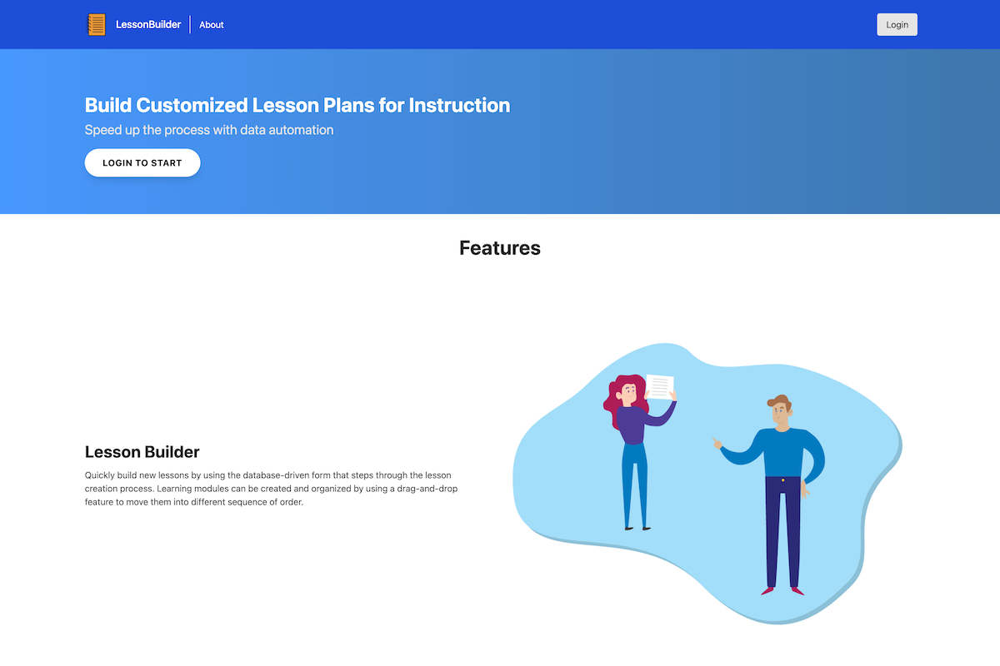

## Introduction

An important service provided by the librarians is to conduct instructional classes to teach students important skills, often called information literacy skills, that will make them better users of the library and researchers. In preparation for teaching these classes, librarians put together lesson plans that are used to help organize and structure the content presented during the class. The lesson plans are an important part of the preparation process to conduct an effective class.

#### The Challenge

The challenge in preparing lesson plans for instruction is that the current method of doing this relies entirely on Microsoft Word documents that are saved as individual files per class instruction given. The Word documents provide a template, but require the librarian to find all the information needed about the class including information about the course in which they are providing instruction, details about the instruction such as date, session length, key instructional concepts, resources used, and specific instructional modules being taught with details for each. Little of this information is standardized and can vary depending on the way it is inputted. The data entry process is also time-consuming and it is cumbersome to work with the Word document.

#### The Solution

The solution is to move the process of creating lesson plans to an online location. By moving the process online it's possible to take advantage of things like auto-populating form fields with data to keep entries consistent, guide the user through the form entry process, and provide the ability to organized the order of instruction through a drag and drop interface. The additional benefits of moving the process online is to keep data stored in a centralized location for statistical purposes. Finally, the online medium makes it possible to access and review saved lesson plans easier from any online device with a web browser.

---

{:class="project-detail-image--full"}
{:class="project-detail-container"}

Lesson Builder - Project Website Homepage
{:class="project-detail-caption"}
