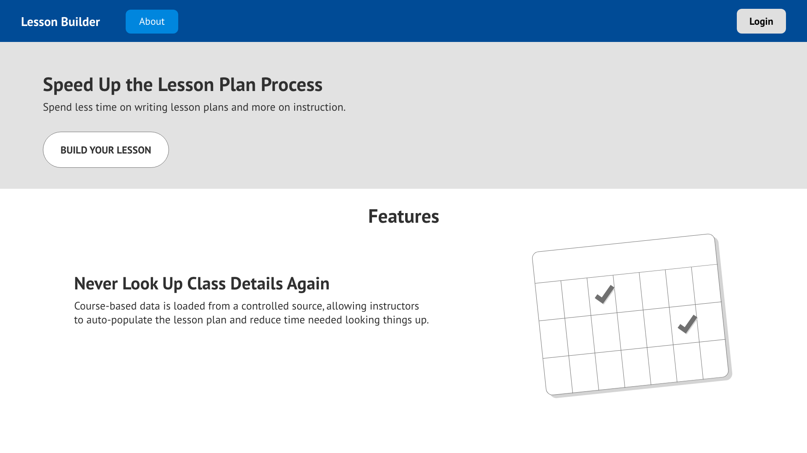
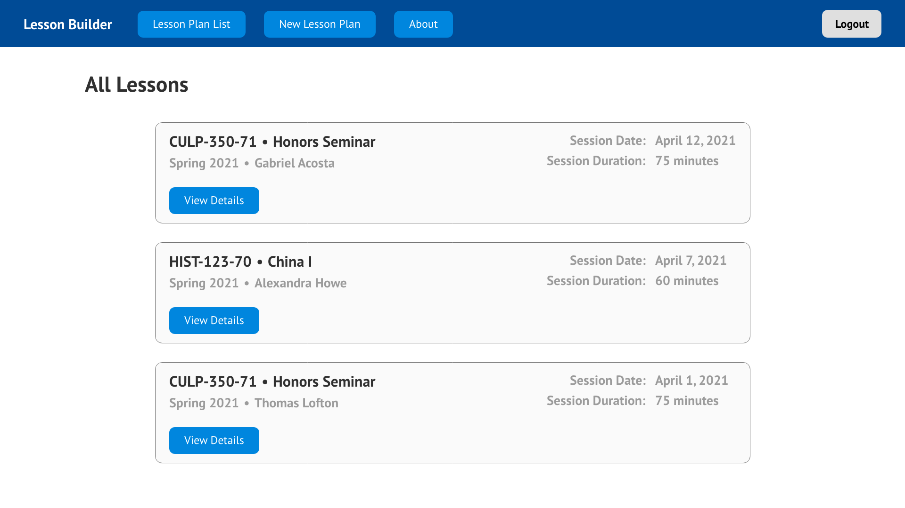
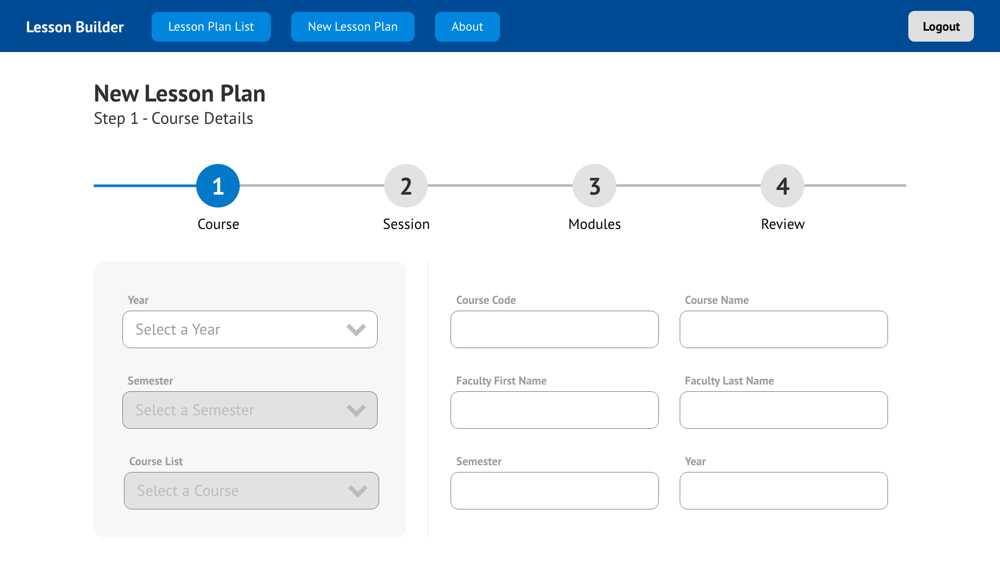

## UX Design

Although the website is not complex from a information architecture perspective, it is still important to work through the design before beginning to develop the website. The major design components of the website included the layout of elements like the header and navigation, list items, and form elements. These are the type of elements that are important to design well on any website. For this site, all these design elements need to be easy to read and their use clear to the user.

{:class="project-detail-image--full"}
{:class="project-detail-container"}

Wireframe - Lesson Builder Home Page
{:class="project-detail-caption"}

The home page shows the navigation, which is simple but clear. On the left side is the title of the site, which can also be joined with a logo graphic as the design progresses. The user is able to login/logout from the persistent button on the right side of the navigation bar.

{:class="project-detail-image--full"}
{:class="project-detail-container"}

Wireframe - Simple Navigation
{:class="project-detail-caption"}

Once a user has logged into the site, all the other navigational links are listed along side the site title - including new options that a logged in user is able to access.

{:class="project-detail-image--full"}
{:class="project-detail-container"}

Wireframe - Logged-In Navigation
{:class="project-detail-caption"}

The more complex design elements of the site are the list for all the lesson plans and the form used to create a new lesson plan. The list of lesson plans is designed to encapsulate each individual lesson plan into a card-like element. The purpose of this is to clearly differentiate each lesson plan from each other. Each list element contains enough key information for the user to understand the contents of the list item and a link within the card to view more information about the item.

{:class="project-detail-image--full"}
{:class="project-detail-container"}

Wireframe - List of Lessons
{:class="project-detail-caption"}

The most complex and important design element of the website is the form used to create a new lesson plan. Users would interact with the form over 4 separate steps before saving a new lesson. It's important for form elements to clearly indicate what data was expected for each input. The design choice to split the form into several steps was made due to the amount of data that was needed to be collected by the form and the different types of form elements that would be used in the form including text and textarea inputs, select option inputs, checkboxes and radio buttons lists, and combinations of form elements for features like the individual instructional modules.

{:class="project-detail-image--full"}
{:class="project-detail-container"}

Wireframe - New Lesson Form
{:class="project-detail-caption"}

To implement the design the CSS Framework [TailwindCSS](https://tailwindcss.com/) was chosen. This framework is easy to use with a front-end library like React since it expected developers to make use of component design. TailwindCSS can be applied to individual design elements like form controls, cards, navigation, and footers, which are elements used in this website. TailwindCSS is also easy to get set up and apply to the website during the development process.
