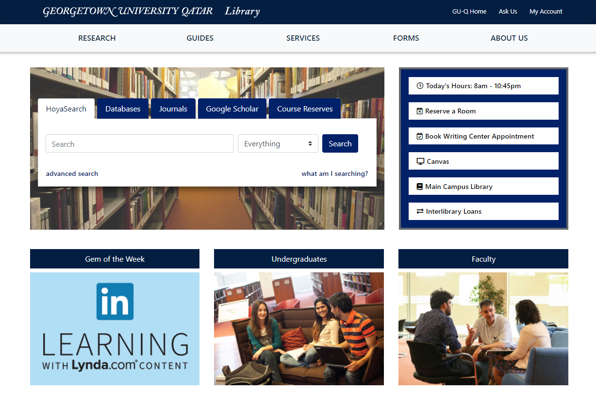

## Introduction

The library website for the Georgetown University in Qatar library needed to be redeveloped in 2019. It had become outdated and had problems with its responsiveness for mobile users. The projects introduced an opportunity to upgrade the website and use newer technologies. The website is used by students constantly and is essential for their success at the university.

#### The Challenge

The previous version of the library website, which I was replacing in this project, made use of an older CSS Framework (Bootstrap 3) and other technologies, that needed to be replaced and updated. This required a process of inventorying the existing website content - updating or replacing - and rethinking the overall site logical structure. Once the information architecture was updated the next challenge was to develop logical and reproducible components that would ultimately be inserted into a Drupal production environment.

#### The Solution

Although I don't use all the features of Drupal, I do make use of the system of blocks to create regions on each page that are defined once and reproduced on several pages. Due to this feature, I choose to use a build system based on pug to replicate the same concept. In Pug, it's possible to create content as includes that can be inserted into a layout for repeatable use. Unique content could then be developed for insertion into a content area for each page on the website.

The final build system chosen was Gulp. Using Gulp, tasks were run for Pug, Sass, as well as incorporation of Bootstrap 4. Running browser-sync also allowed for basic development testing and debugging.

{:class="project-detail-image--full"}
{:class="project-detail-container"}

Library Website - Project Website
{:class="project-detail-caption"}

#### Requirements

The following requirements formed the baseline of functionality for the initial release of the project.

* Must have a final implementation using Drupal
* Must implement accessibility standards for use by screen-readers
* Must be responsive, allowing for ease of use on tablet and mobile devices
* Must have solutions to route users to external resources via search boxes, links, etc.
* Must implement a corporate design in the look & feel of the website