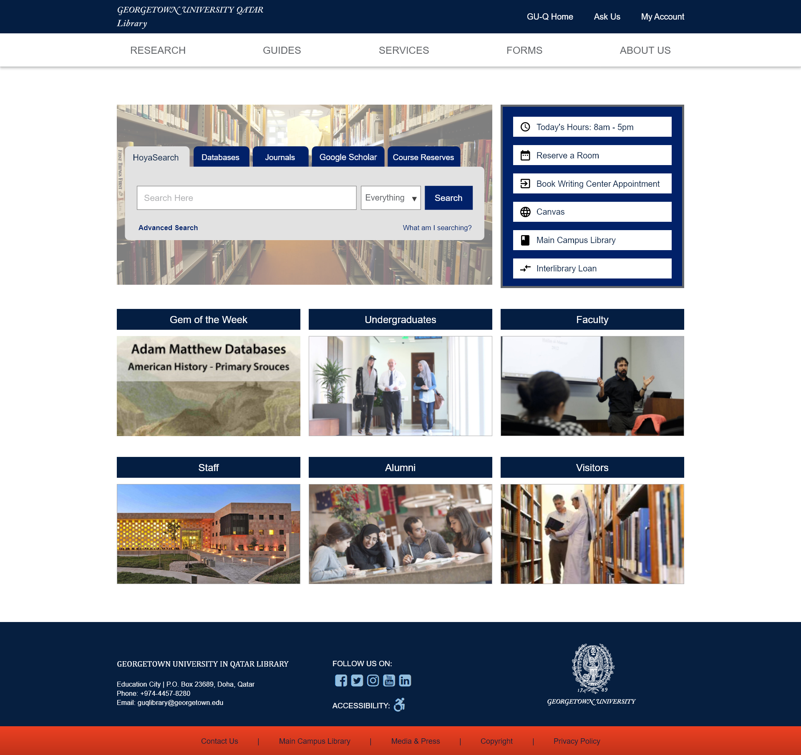
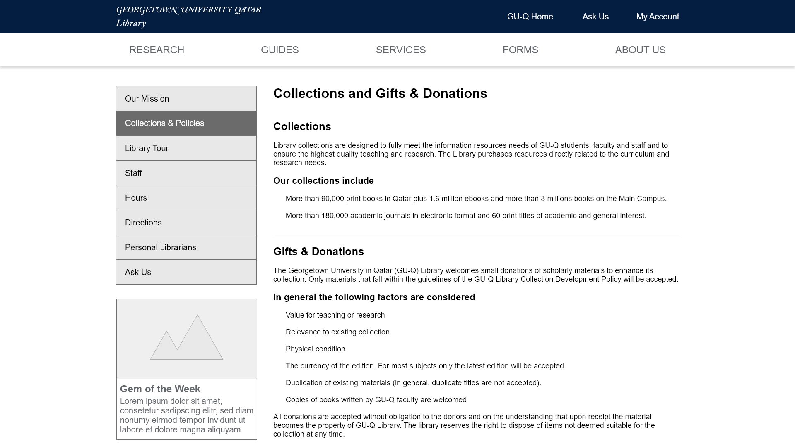

## UX Design

Because the library website's look and feel were being updated with the redevelopment project it was important to create prototypes before beginning any coding. Prototypes allowed me to get a sense of the design feasibility before working on any coding.

The most import aspect of the design was to make use of the university corporate design colors, typography, and image usage. Beyond that the design was flexible.

For a university library website the design is generally more conservative. For this website, it was important to have a clear design that focused users' attention on the main search box. Beyond that, the design is uncomplicated and information-focused.

{:class="project-detail-image--full"}
{:class="project-detail-container"}

Prototype - Library Website Home Page
{:class="project-detail-caption"}

Sub pages have an added feature of a contextual side-bar on the left that provides links to related content. The sub pages also have a breadcrumb navigation and consistent headers for all pages on the site.

{:class="project-detail-image--full"}
{:class="project-detail-container"}

Prototype - Library Website Sub Page
{:class="project-detail-caption"}

The prototyping process was done using Adobe XD, which allowed for testing of some features such as the navigation.
