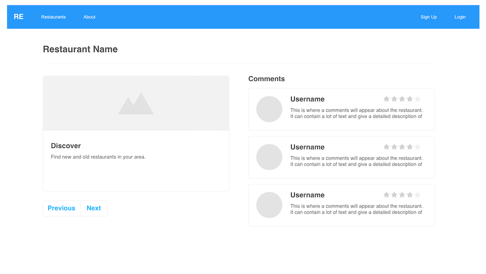

For my Rails & Javascript portfolio project - Restaurant Explorer - I wanted to fulfill the requirements and challenge myself.<!-- more -->

After a bit of a slow period progressing through the [Flatiron School](https://flatironschool.com/) curriculum, I've jumped back in and pushed forward - arriving at the Ruby on Rails + Javascript project. For this project, I wanted to accomplish a few different things:

1. Reinforce some of the important aspects of the Rails section of the curriculum
1. Satisfy the requirements for the Rails + Javascript project
1. Push myself to incorporate something new - Bootstrap 4 - and craft an attractive design

I feel pretty happy about the results I achieved. The basic concepts of **Restaurant Explorer** is a website that allows users to view both a long list of local restaurants and individual pages for each restaurant. The individual pages include an associated comments section. A logged in user can also add comments to a restaurant - which displays the new comment without any page refresh.

/assets/img/blog/{{page.featured-image}}


#### Don't Skip the Design

It's not a requirement for the curriculum, but I feel it's important to spend some time on design along side with coding. I want to focus on the code, naturally, but I also want to present something attractive when putting together my project. To that end, I spent time learning how to make use of the [Bootstrap 4 gem](https://github.com/twbs/bootstrap-rubygem) and add it to my asset pipeline in Rails. An article from Medium - [How to add Bootstrap 4 to a Rails 5 app](https://medium.com/@biancapower/how-to-add-bootstrap-4-to-a-rails-5-app-650118459a1e) - was helpful in the configuration process. Rails 5.1 and forward dropped the JQuery dependency from their default stack, so I had to add the [jquery-rails](https://github.com/rails/jquery-rails) gem - required to make some features of Bootstrap 4 work properly.

An important part of the design process (and coding) process is planning. This is something I don't take for granted as I progress through the curriculum. I spent time creating some wireframes for the important pages of the application - an index page listing all restaurants and a show page that displays individual restaurant details.

{:class="project-detail-image--three-fourths"}
{:class="project-detail-container"}

{:class="project-detail-image--three-fourths"}
{:class="project-detail-container"}

{:class="project-detail-image--three-fourths"}
{:class="project-detail-container"}

#### Data Model

Another important part of the project is the data model. This is also something best to be planned out before coding anything. With this in mind, I spent some time putting together an entity relationship diagram that visualized my data tables and their associations.

{:class="project-detail-image--three-fourths"}
{:class="project-detail-container"}

The main focus of the site was the `Restaurants` table. And the associated many-to-one `Comments` table is where my `has_many` relationship is located for the project. Wanting to do something more interesting than just this, I also added other tables, including a `Users` table that supported the login/logout feature. I added some other tables associated to the Restaurants table to add data that I could use later as data for filters.

#### Rails

An essential aspect of this portfolio project was to expose the data via json. To achieve this, I made use of the `Active Model Serializers` gem. In it's basic usage - an active model serializer is great for serializing database content, especially content that is built with relational content. Setting up serialization was as easy as generating a serializer for a model and defining the associations that needed to be serialized.

```ruby
class RestaurantSerializer < ActiveModel::Serializer
  attributes :id, :name, :description, :phone, :email, :image_url
  belongs_to :location
  has_many :cuisines
  has_many :comments, serializer: RestaurantCommentSerializer
end
```

In the example above, my `Restaurants` model had associations with the `Locaions`, `Cuisines`, and `Comments` tables. And the `Comments` table had its own associations, which I also wanted to capture in my json output. In order to create the output, I utilized the `respond_to` block to execute the serializer and produce the json output.

```ruby
def show
  @restaurant = Restaurant.find(params[:id])

  respond_to do |format|
    format.html { render :show }
    format.json { render json: @restaurant }
  end
end
```

At first, I was frustrated when the serializer content I had designated to be output seemed to be ignored. This as happening with the `Users` data that was more than one level of associations deep was ignoring the specifications of the serializer. For example, my `RestaurantCommentSerializer` and `UserSerializer` was defined as the following:

```ruby
class RestaurantCommentSerializer < ActiveModel::Serializer
  attributes :body, :rating
  belongs_to :user
end

class UserSerializer < ActiveModel::Serializer
  attributes :first_name, :last_name, :username
  belongs_to :avatar
end
```

The data returned, however, included user data I didn't want in my json - like the `password_digest` information. After a long search, I discovered that to get the active model serializers to work like I wanted, I needed to add some code to a `config/initializers/active_model_serializer.rb` file to successfully serialize deeply nested associations.

```ruby
ActiveModel::Serializer.config.default_includes = '**'
```

Once I added this, and restarted the server, I was able to output the desired json data. Here's an example of one single restaurant and its associations from the database.

```json
{
  "id": 49,
  "name": "Classic Dining",
  "description": "Small food, big taste, come enjoy quality eats.",
  "phone": "7035558789",
  "email": "classicdining@eats.net",
  "image_url": "restaurant-11.jpg",
  "location": {
    "city": "Tysons Corner"
  },
  "cuisines": [
    {
      "name": "Thai"
    },
    {
      "name": "Chinese"
    },
    {
      "name": "American"
    }
  ],
  "comments": [
    {
      "body": "Impressive location, the food goes along with it too. Nice place.",
      "rating": 4,
      "user": {
        "first_name": "Abe",
        "last_name": "Area",
        "username": "abearea",
        "avatar": {
          "name": "bear",
          "image_url": "bear.png"
        }
      }
    },
    {
      "body": "Enjoyed my time. The live music added to the cozy atmosphere.",
      "rating": 4,
      "user": {
        "first_name": "Bob",
        "last_name": "Cobb",
        "username": "bobcobb",
        "avatar": {
          "name": "bear",
          "image_url": "bear.png"
        }
      }
    }
  ]
}
```

#### Working with Javascript

The next challenge was to take the json content and work with it via Javascript. I took some time to fine tune my Javascript Model Objects. I decided to use the ES6 class syntax as the blueprint to build my objects. The main class I used was the Restaurant class. I also wrote a getter method to format a phone number. Finally, I created other methods and took advantage of ES6 template literals to output html with model content - as can be seen in the method `singleHTML()` below.

```javascript
class Restaurant {
  constructor(obj) {
    this.id = obj.id;
    this.name = obj.name;
    this.description = obj.description;
    this._phone = obj.phone;
    this.email = obj.email;
    this.image = obj.image_url;
    this.location = obj.location.city;
    this.cuisines = obj.cuisines;
  }

  // getter for phone that adds formatting for area codes
  get phone() {
    var re = /\(?(\d{3})\)?[- ]?(\d{3})[- ]?(\d{4})/g;
    var subst = "($1) $2-$3";
    return this._phone.replace(re, subst);
  }

  singleHTML() {
    return `
      <div class="card mb-3">
        
        <div class="card-body">
          <h5 id="restaurant-name-card" class="card-title">${this.name}</h5>
          <p id="restaurant-description" class="card-text">${
            this.description
          }</p>
          <div class="card-info-box">
          <div class="restaurant-contact">
            <p class="card-text mb-n1"><i class="fa fa-phone" style="color: black;"></i> <small class="text-muted">${
              this.phone
            }</small></p>
            <p class="card-text mb-n1"><i class="fa fa-envelope" style="color: black;"></i> <small class="text-muted">${
              this.email
            }</small></p>
            <p class="card-text"><i class="fa fa-map-marker" style="color: black;"></i> <small class="text-muted">${
              this.location
            }</small></p>
          </div>
          <div class="restaurant-cuisines">
          ${this.getCuisineNames(
            this.cuisines
          )} <p class="ml-1"><strong>Cuisines</strong>: </p>
          </div>
        </div>
      </div>
    `;
  }
}
```

Working with json content, I used iterators and JQuery to process the data and append content to the DOM. The challenge here was to work through the logical process step-by-step of collecting the data, parsing it, and displaying it on the page in an organized way as well as responding to user interactions properly. The final result was satisfying.

{:class="project-detail-image--half"}
{:class="project-detail-container"}

#### Final Thoughts

This project was challenging - but not too challenging. The Rails curriculum content was great to prepare me for the rails-specific aspects of the project. I felt that in this project, I was able to produce some refined rails code. I feel more and more comfortable with rails concepts like validation, scoping, helper classes and methods, and more.

The Javascript portion of the project was also challenging. When working with Javascript in the past, I found that it was easy to write long functions that did everything within the single function call. This project has helped me work on skills like refactoring code, single responsibility principle (although I wasn't 100% perfect at this), and adding meaning names and comments to my code. There are all skills I want to continue improving as I move forward.
