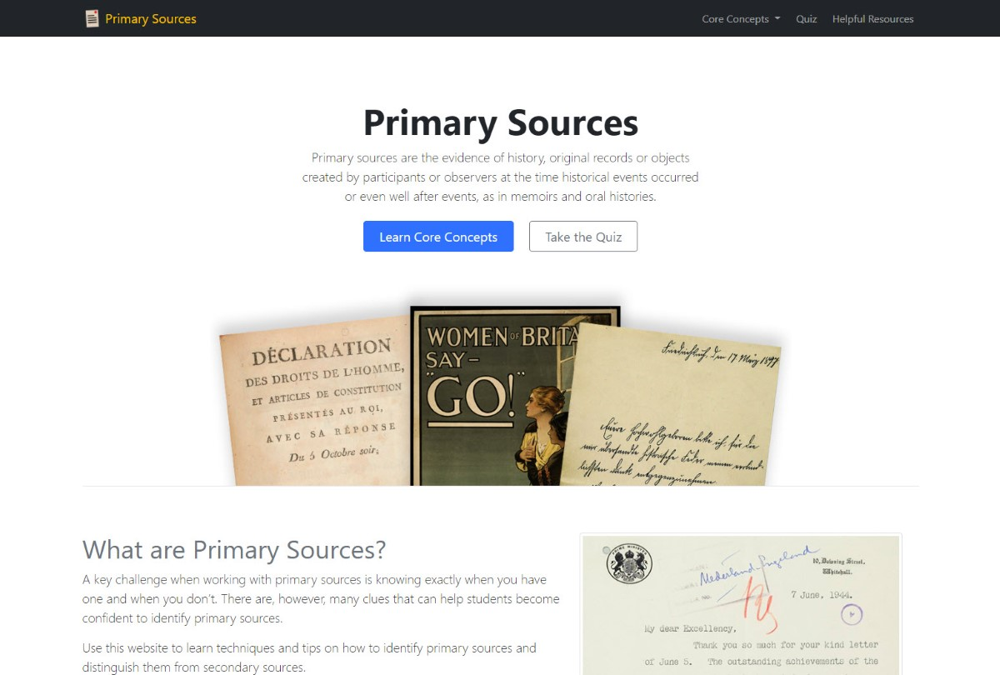

## Introduction

At my organization, librarians perform an important task of teaching students different aspects of information literacy. Understanding how to identify, find, and access primary and secondary sources is one particularly important skill students need to master. As part of the instructional process, librarians teach students important concepts and hands-on skills related to primary and secondary sources. It's also useful to be able to assess student understanding of the material.

#### The Challenge

A key challenge of conducting instruction on topics of information literacy is to create engaging and impactful content that is accessible to students. Content that is text-heavy without a mix of other types of content (i.e. images, tables, videos, lists, etc.) is less engaging for students. Since students have extensive experience using a variety of media and devices, a key challenge is finding ways to deliver content to them that meet these standards.

#### The Solution

Instead of delivering the content in un-dynamic ways, the solution involved creating a website with a fresh look-and-feel to it. The website would essentially deliver the same content that is used with older and more static methods of delivery, but provide a fully-responsive experience with a fresh mix of the existing content and media. The solution also includes an interactive element - a quiz that students could take on the website that puts their knowledge to the test and provides immediate feedback.

---

{:class="project-detail-image--full"}
{:class="project-detail-container"}

Primary Sources - Project Website Homepage
{:class="project-detail-caption"}

#### Technologies Used

The website did not require students to login and did not make use of a complex back-end, and therefore wasn't overly complex in terms of technologies needed. However, the project did present some novel challenges. First, the website design made use of Bootstrap 5, which was released in May 2021. Although this version of Bootstrap was a continuation of most of the core features in previous versions of Bootstrap, it [added many optimizations](https://blog.getbootstrap.com/2021/05/05/bootstrap-5/) including the removal of JQuery and enhancement of components like the Navbar.

In addition to Bootstrap 5, the website did make use of a dynamic approach to the quiz feature which involved loading the quiz content from an external JSON file and dynamically building the HTML and the event handlers for the quiz and its interactive features. Taking this approach adds the flexibility of adding, removing, or modifying the quiz content by updating the external JSON file alone.
