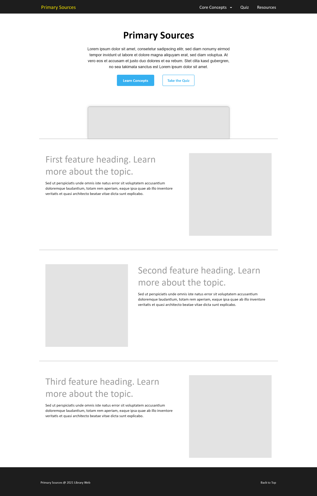
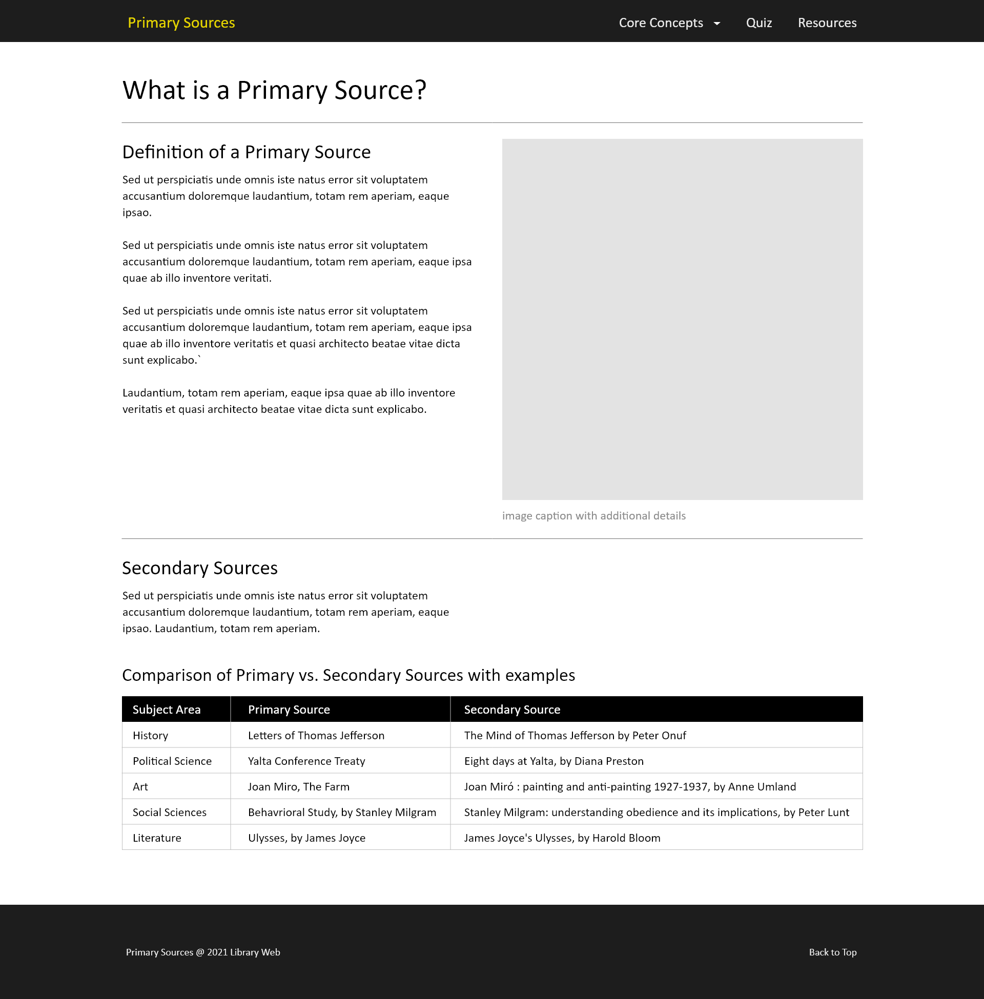
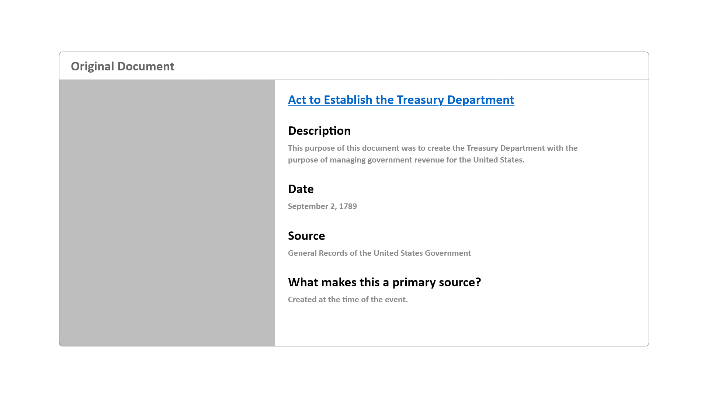
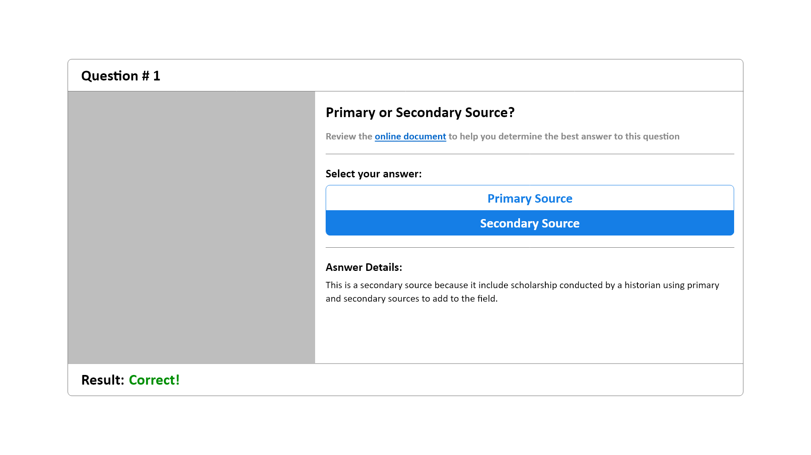

## UX Design

A key goal of this project is to combine different content types like images, text, tables, and lists on the different pages to make the content more interesting for students. However, the overall design needed to remain relatively minimal to keep students focus on the core content without adding additional distractions. To achieve this, the website layout and organization took advantage of Bootstrap's grid system and components to combine text and images onto the page in a way that was easy to read and understand.

#### Home Page

The Home Page design included introductory text along with a hero image and a call to action buttons. Further down the page, there are several header, text, image combinations that are intended to briefly introduce students to the main themes of the website that are explored in more detail on the website sub-pages. The intent of the home page is to draw students into the website visually and show them how to get started.

{:class="project-detail-image--full"}
{:class="project-detail-container"}

Wireframe - Primary Sources Home Page
{:class="project-detail-caption"}

#### Sub-Pages

The sub-pages of the website explore different ways to combine content, text and images or text as tabular content in the example here. Lines of text are also kept short to improve readability. The sub-pages were the core "instructional" spaces of the website, therefore the design focused on highlighting key concepts and providing multiple examples using images and different text combinations. Bootstrap offers several different components - tables, images with captions, etc. to present content attractively.

{:class="project-detail-image--full"}
{:class="project-detail-container"}

Wireframe - Primary Sources Sub-Page
{:class="project-detail-caption"}

#### Card Component

One of the most versatile Bootstrap components is the [card component](https://getbootstrap.com/docs/5.1/components/card/). There are many different ways to combine content on a card component. For the design of this website, the card component is used for the examples of primary sources and included images along with textual details within each card.

{:class="project-detail-image--full"}
{:class="project-detail-container"}

Wireframe - Primary Sources Content Card
{:class="project-detail-caption"}

Also making use of the card component, the website's quiz page presents a card that contains an image and question with a vertical button group that contained multiple choices for students to select.

{:class="project-detail-image--full"}
{:class="project-detail-container"}

Wireframe - Primary Sources Quiz Card
{:class="project-detail-caption"}
