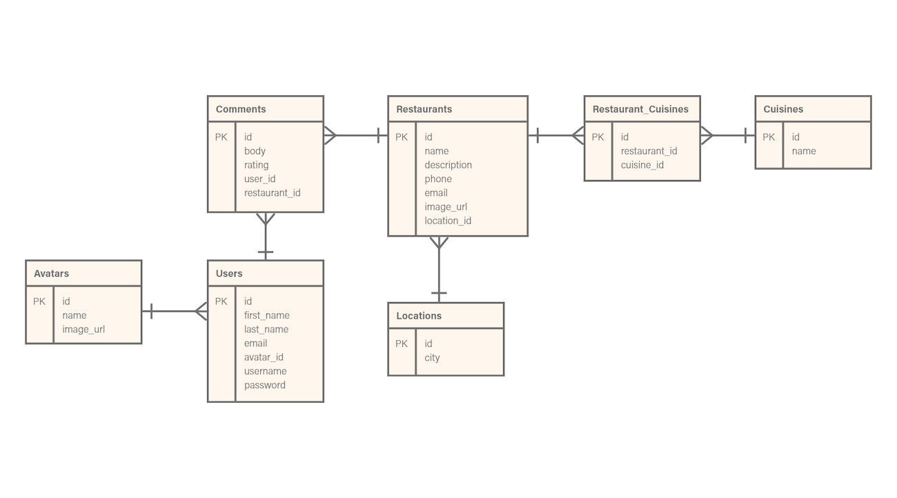

## Development

The point of the project is, of course, the skills shown in the development phase. The areas of notable development were the database, the data serializing with `Active Model Serializer` and the front-end processing via JavaScript.

#### Database

The data model for the project included several tables - as described below in the project entity relationship diagram (ERD). The focal database table for the project is the `Restaurants` table. From this table is a many-to-one relationship with the `Comments` table. Users are also attached to a restaurant via comments. I also made use of look-up tables for locations and a many-to-many table for possible cuisines each restaurant offered.

{:class="project-detail-image--full"}
{:class="project-detail-container"}

Entity Relationship Diagram
{:class="project-detail-caption"}

#### Active Model Serializers

An essential aspect of this portfolio project was to expose the data via json. To achieve this, I made use of the `Active Model Serializers` gem. In it's basic usage - an active model serializer is great for serializing database content, especially content that is built with relational content. Setting up serialization was as easy as generating a serializer for a model and defining the associations that needed to be serialized.

```ruby
class RestaurantSerializer < ActiveModel::Serializer
  attributes :id, :name, :description, :phone, :email, :image_url
  belongs_to :location
  has_many :cuisines
  has_many :comments, serializer: RestaurantCommentSerializer
end
```

In the example above, my `Restaurants` model had associations with the `Locaions`, `Cuisines`, and `Comments` tables. And the `Comments` table had its own associations, which I also wanted to capture in my json output. In order to create the output, I utilized the `respond_to` block to execute the serializer and produce the json output.

```ruby
def show
  @restaurant = Restaurant.find(params[:id])

  respond_to do |format|
    format.html { render :show }
    format.json { render json: @restaurant }
  end
end
```

#### JavaScript

The next challenge was to take the json content and work with it via Javascript. I took some time to fine tune my Javascript Model Objects. I decided to use the ES6 class syntax as the blueprint to build my objects. The main class I used was the Restaurant class. I also wrote a getter method to format a phone number. Finally, I created other methods and took advantage of ES6 template literals to output html with model content - as can be seen in the method `singleHTML()` below.

```javascript
class Restaurant {
  constructor(obj) {
    this.id = obj.id;
    this.name = obj.name;
    this.description = obj.description;
    this._phone = obj.phone;
    this.email = obj.email;
    this.image = obj.image_url;
    this.location = obj.location.city;
    this.cuisines = obj.cuisines;
  }

  get phone() {
    var re = /\(?(\d{3})\)?[- ]?(\d{3})[- ]?(\d{4})/g;
    var subst = "($1) $2-$3";
    return this._phone.replace(re, subst);
  }

    singleHTML() {
    return `
      <div class="card mb-3">
        
        <div class="card-body">
          <h5 id="restaurant-name-card" class="card-title">${this.name}</h5>
          <p id="restaurant-description" class="card-text">${
            this.description
          }</p>
          <div class="card-info-box">
          <div class="restaurant-contact">
            <p class="card-text mb-n1"><i class="fa fa-phone" style="color: black;"></i> <small class="text-muted">${
              this.phone
            }</small></p>
            <p class="card-text mb-n1"><i class="fa fa-envelope" style="color: black;"></i> <small class="text-muted">${
              this.email
            }</small></p>
            <p class="card-text"><i class="fa fa-map-marker" style="color: black;"></i> <small class="text-muted">${
              this.location
            }</small></p>
          </div>
          <div class="restaurant-cuisines">
          ${this.getCuisineNames(
            this.cuisines
          )} <p class="ml-1"><strong>Cuisines</strong>: </p>
          </div>
        </div>
      </div>
    `;
  }
}
```

To ease the interaction with the DOM, I made use of JQuery. This allowed for quick attachment/replacement of data to DOM elements. The website has minimal page refreshes, with most  of the data needed for the page loaded and stored in variables.