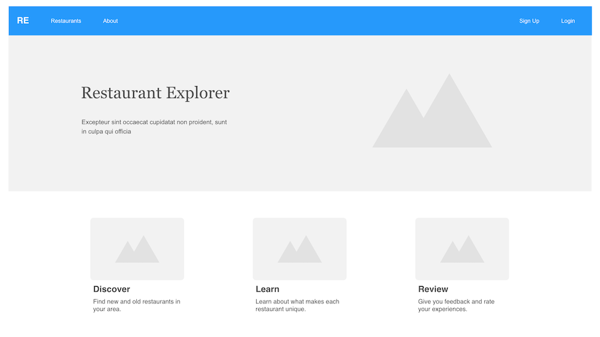

## UX Design

Although I didn't undertake a full-fledged UX process for this project, some design planning was important and useful. I was thinking of the design in conjunction with the information architecture of the website - and they often can compliment each other during the planning process of a project.

#### Wireframes

The main aspect of UX Design for this project was creating wireframes that laid out the page organization and element spacing. Using Bootstrap 4 allowed me to take advantage of many of their components - like navbars and cards - to plan my design. I produced three wireframes for the major sections of the project - the home page, the restaurant list page, and the restaurant detail page.

{:class="project-detail-image--full"}
{:class="project-detail-container"}

Wireframe - Home Page
{:class="project-detail-caption"}

{:class="project-detail-image--full"}
{:class="project-detail-container"}

Wireframe - List Page
{:class="project-detail-caption"}

{:class="project-detail-image--full"}
{:class="project-detail-container"}

Wireframe - Detail Page
{:class="project-detail-caption"}

The colors and typography for the website weren't as important - and the Bootstrap 4 defaults for each worked well for this project.